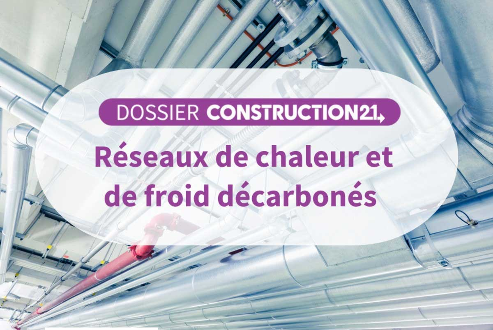

# Dossier spécial sur les réseaux de chaleur

[Construction21 - France](https://www.linkedin.com/company/construction21-france/) consacre un dossier spécial sur le thème des [#RéseauChaleurFroid](https://www.linkedin.com/feed/hashtag/?keywords=r%C3%A9seauchaleurfroid\&highlightedUpdateUrns=urn%3Ali%3Aactivity%3A7023643684474621952) décarbonés, auquel nous sommes heureux d'avoir pu contribuer. 😃🙏

La densification des réseaux de chaleur, quels enjeux ? 👀\
C'est à lire dans notre article !

[https://www.construction21.org/france/articles/h/densifier-les-reseaux-de-chaleur-un-contexte-favorable-et-un-potentiel-considerable-mais-des-defis-a-relever.html](https://www.construction21.org/france/articles/h/densifier-les-reseaux-de-chaleur-un-contexte-favorable-et-un-potentiel-considerable-mais-des-defis-a-relever.html)

