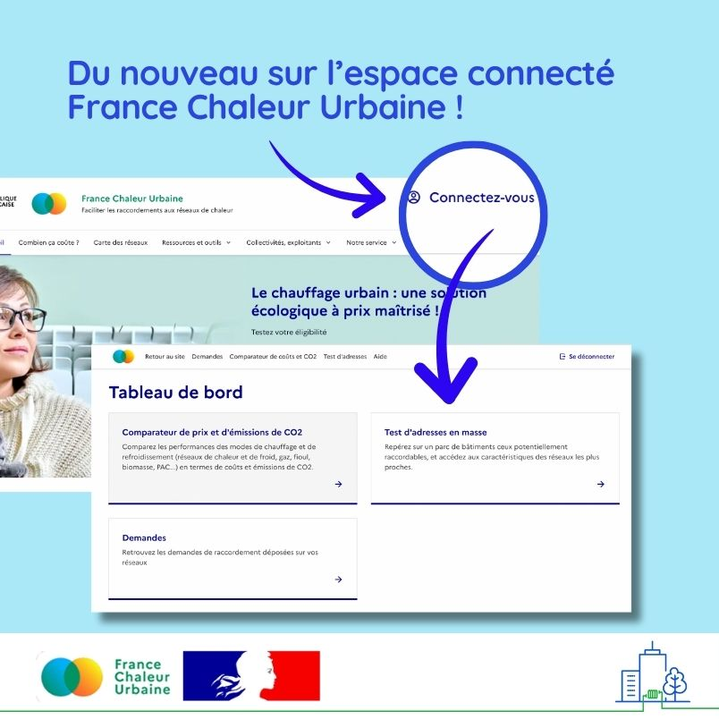

# Du nouveau sur l'espace connecté France Chaleur Urbaine

🎉 Enfin l'espace connecté France Chaleur Urbaine ! Des fonctionnalités avancées qui répondent aux besoins des professionnels (bureaux d'études, collectivités, opérateurs de réseaux, gestionnaires de bâtiments...).

Avec notre espace connecté :

✅ Comparez les coûts et émissions de CO2 de 16 modes de chauffage
\
Nouveau : l’export Excel de vos résultats, la sauvegarde de votre configuration et la possibilité de la partager à vos interlocuteurs

✅ Testez instantanément l’ensemble de vos adresses (pour les gestionnaires de parcs de bâtiments)
\
Nouveau : un tableau de bord synthétique des résultats et une visualisation cartographique, la sauvegarde de l’ensemble de vos tests

✅ Retrouvez l’ensemble des demandes proches de vos réseaux de chaleur dans une interface repensée (pour les collectivités et opérateurs des réseaux)
\
Nouveau : un tableau de bord interactif, l’enregistrement de vos réponses-types

👉 Vous êtes intéressé(e) ? C'est par [ici](/connexion) !

<figure><figcaption></figcaption></figure>
