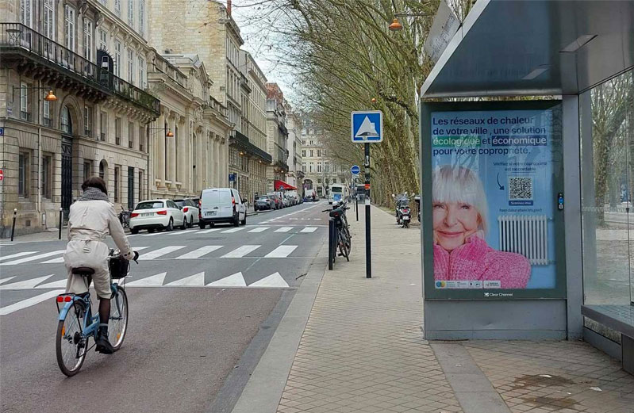

# Faisons connaître le chauffage urbain !

📣 Promouvoir les réseaux de chaleur auprès du grand public ? C'est un défi que France Chaleur Urbaine relève !\
🚌 Retrouvez notre campagne publicitaire sur les abribus à Bordeaux dès aujourd'hui.\
🤝 Cette campagne est réalisée en lien avec [Bordeaux Métropole](https://www.linkedin.com/company/bordeaux-m%C3%A9tropole/), [Mixéner](https://www.linkedin.com/company/mixener-groupebme/) et [ENGIE](https://www.linkedin.com/company/engie/).

<figure><figcaption></figcaption></figure>

