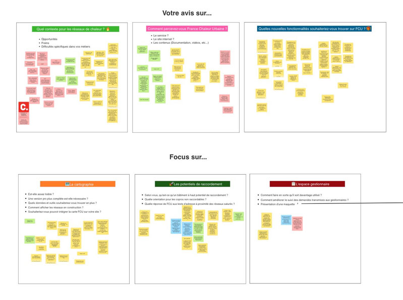

# France Chaleur Urbaine se construit avec ses usagers

France Chaleur Urbaine est une start-up d'Etat qui se construit pour et avec ses usagers !

👥 Hier, 38 participants se sont joints à notre 3ème atelier de co-construction : collectivités, exploitants, bureaux d'études, institutionnels, associations...

🙌 Merci à eux pour leur participation et leurs nombreuses suggestions, qui vont permettre à notre service de s'améliorer et de s'enrichir encore !

Vivement le prochain atelier !

