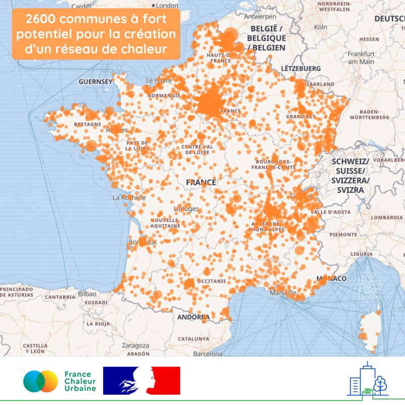

# Identifier les communes au plus fort potentiel pour la création d'un réseau de chaleur

De nombreux territoires présentent un réel potentiel pour la création de réseaux de chaleur... mais encore faut-il pouvoir les identifier !\
\
🗺️ C'est ce que nous vous proposons avec la carte ci-dessous : elle recense 2600 communes non encore équipées d'un réseau de chaleur, sur lesquelles il existe un fort potentiel pour la création d'un réseau.\
\
📍 La [version interactive de la carte](https://france-chaleur-urbaine.beta.gouv.fr/carte?accordions=Potentiel+par+territoire\&tabId=potentiel\&additionalLayers=communesFortPotentielPourCreationReseauxChaleur) vous permettra de les filtrer par nombre d'habitants, mais aussi de cliquer sur chaque commune concernée pour connaître les besoins en chauffage et eau chaude sanitaire qui pourraient être y couverts par un réseau de chaleur. L'évaluation des potentiels a été réalisée par le [Cerema](https://www.cerema.fr/fr) dans le cadre du projet [EnRezo](https://reseaux-chaleur.cerema.fr/espace-documentaire/enrezo). Pour aller plus loin, vous pourrez également visualiser où se situent les zones les plus propices à l'implantation d'un réseau sur ces territoires [ici](https://france-chaleur-urbaine.beta.gouv.fr/collectivites-et-exploitants/potentiel-creation-reseau) !\
\
🎯 Un outil indispensable pour atteindre l'objectif de triplement des livraisons de chaleur par les réseaux prévu par le projet de programmation pluriannuelle de l'énergie (PPE3)  à l'horizon 2035.

<figure><figcaption></figcaption></figure>
