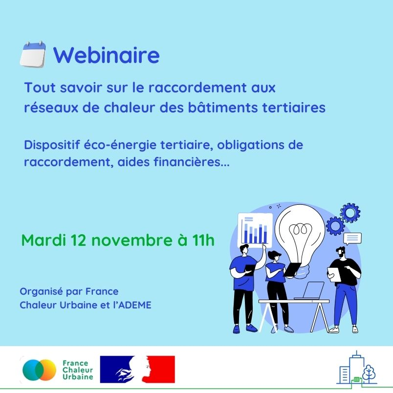

# Informer les gestionnaires de bâtiments tertiaires sur les réseaux de chaleur

🏢 Après notre intervention auprès des copropriétés, nous avons proposé un webinaire dédié au raccordement aux réseaux de chaleur des bâtiments tertiaire le mardi 12 novembre, co-organisé avec l'ADEME.\
\
Au programme :\
✔ Connaître les obligations de raccordement et les aides financières mobilisables\
✔ Valoriser un raccordement dans le cadre du dispositif Éco-Énergie Tertiaire et sur la plateforme Operat\
✔ Passer à l'action avec France Chaleur Urbaine, le service public de référence pour initier un projet de raccordement.\
\
Ce webinaire s'adressait aux propriétaires et gestionnaires de bâtiments tertiaires, ainsi qu'aux bureaux d'études qui les accompagnent.&#x20;

Vous souhaitez accéder au replay ? [Contactez-nous](https://france-chaleur-urbaine.beta.gouv.fr/contact) !

<figure><figcaption></figcaption></figure>
