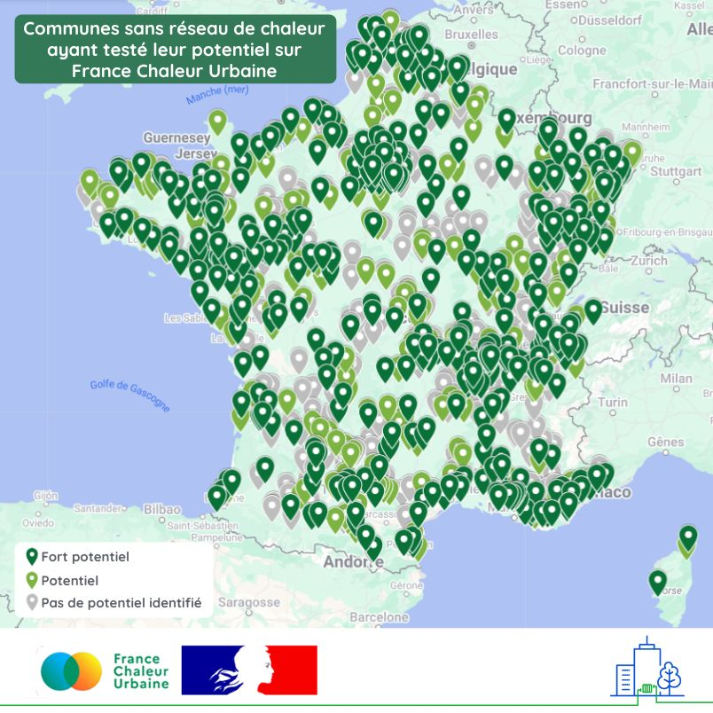

# Initier un projet de réseau avec France Chaleur Urbaine

💥Avec France Chaleur Urbaine, plus de 700 communes ont pu découvrir que leur territoire présente un réel potentiel pour la création d'un réseau de chaleur, et plus d'une centaine d'entre elles ont souhaité bénéficier d'un accompagnement personnalisé pour initier un projet de réseau !\
\
Comment ? Grâce à l'outil de sensibilisation dédié aux élus mis en ligne fin 2024, sur lequel 2300 tests ont déjà été effectués, pour plus de 1400 communes différentes. Des communes situées sur l'ensemble du territoire français, comme l'illustre la carte ci-dessous.\
\
🤝 Pour fournir un accompagnement personnalisé aux communes qui le souhaitent, France Chaleur Urbaine s'appuie sur les dispositifs financés par l'ADEME en travaillant en lien étroit avec l'Association Amorce, le Cerema et l'ensemble des relais locaux (CCRT, animateurs bois énergie et géothermie...).\
\
👉 Vous êtes intéressé(e) par cette démarche ? Retrouvez :&#x20;

* notre outil : [https://france-chaleur-urbaine.beta.gouv.fr/collectivites-et-exploitants/potentiel-creation-reseau](/collectivites-et-exploitants/potentiel-creation-reseau)
* la présentation de notre webinaire dédié à l'initiation de réseaux de chaleur organisé début 2025 : [https://france-chaleur-urbaine.beta.gouv.fr/webinaire/2025/presentation-initier-un-reseau](/webinaire/2025/presentation-initier-un-reseau)
* le replay de notre webinaire dédié à l'initiation de réseaux de chaleur organisé début 2025 : \
  [https://france-chaleur-urbaine.beta.gouv.fr/webinaire/2025/replay-initier-un-reseau](/webinaire/2025/replay-initier-un-reseau)

<figure><figcaption></figcaption></figure>
