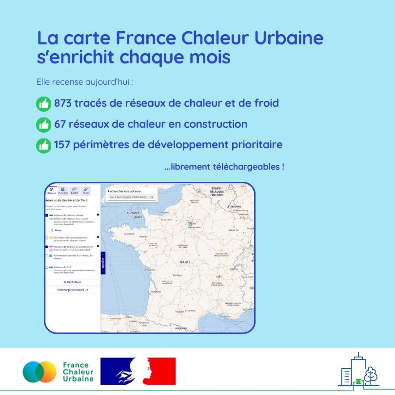

# La carte France Chaleur Urbaine continue de s'enrichir !

🗺 Chaque mois, la [carte France Chaleur Urbaine](/carte) s'enrichit !\
\
✔️ Ce mois-ci c’est notamment au tour de réseaux du [SDEM50 | Syndicat Départemental d'Énergies de la Manche](https://www.sdem50.fr/) et du [Syndicat Départemental d'Energies du Rhône (SYDER)](https://www.syder.fr/) de voir leurs tracés compléter la carte, ou encore de ceux des communes d’Évron, de Beaufort, de Quimper, du Russey, de Pontaumur, de Nemours, de Poisson, d’Ardes-sur-Couze et de Donges !\
\
🔎 La carte France Chaleur Urbaine est consultée par 10 000 visiteurs par mois, particuliers et professionnels : fournir une donnée la plus à jour et exhaustive possible contribue au développement efficace des réseaux.\
\
📢 Vous souhaitez ajouter un tracé ou un périmètre de développement prioritaire sur la carte, ou encore télécharger l'ensemble des tracés et données ? Rendez-vous sur notre [formulaire de contribution](/contribution).

<figure><figcaption></figcaption></figure>
