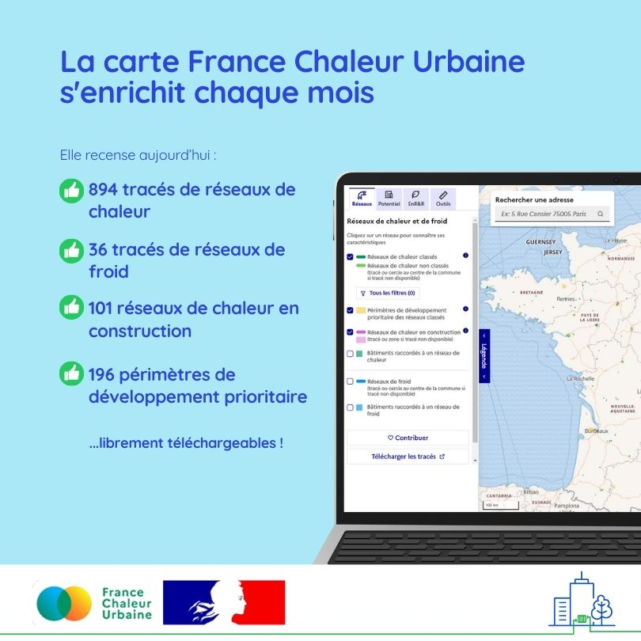

# La carte France Chaleur Urbaine passe un cap !

La [carte France Chaleur](/carte) Urbaine passe un nouveau cap : les tracés des réseaux de chaleur recensés représentent désormais plus de 95% des livraisons de chaleur annuelles en France !&#x20;

\
Ont été ajoutés ce mois-ci :\
\
✅ 26 tracés de réseaux de chaleur, et notamment celui du réseau privé du [GIE Osiris](https://www.osiris-gie.com/) qui alimente la plateforme chimique de Roussillon en Auvergne Rhône-Alpes. Il s'agit du deuxième réseau en France en termes de livraisons de chaleur, derrière le réseau parisien !\
✅14 réseaux de chaleur en construction ;\
✅ 9 périmètres de développement prioritaire.\
\
L'ensemble des tracés des réseaux gérés par les opérateurs [Dalkia](https://www.dalkia.fr/) et [Idex](https://www.idex.fr/) ont par ailleurs été actualisés.

Quelques exemples d'ajouts :\
\- Les réseaux de chaleur en service à Bischwiller, Briouze, Arbas, Lunéville, Mazet Saint-Voy, Saulnot, Les Martres de Veyre...\
\- les réseaux en construction à Agen, Dinan, Hombourg-le-Haut, Bourg Saint-Maurice - Les Arcs;, Boussy-Saint-Antoine, Avion, Nîmes, Besançon, Calais... \
\- les périmètres de développement prioritaire des réseaux de Maisons-Alfort, Grand Cognac, Plougastel-Daoulas, Caillac... \
\
🙏 Merci à tous nos contributeurs, maîtres d'ouvrage et gestionnaires de réseaux !

<figure><figcaption></figcaption></figure>
