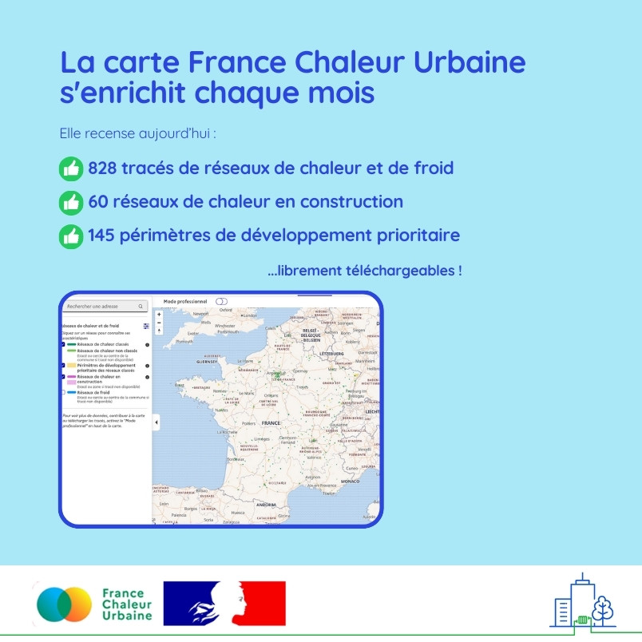

# La carte France Chaleur Urbaine s'enrichit !

🗺 Chaque mois, la carte France Chaleur Urbaine s'enrichit !\
\
🤝 Grâce aux contributions des collectivités et acteurs locaux, des opérateurs des réseaux et de l'ADEME, elle compte désormais 828 tracés de réseaux de chaleur et de froid en service, 60 réseaux de chaleur en construction et 145 périmètres de développement prioritaire.\
\
🔎 La carte France Chaleur Urbaine est consultée par 10 000 visiteurs par mois, particuliers et professionnels : fournir une donnée la plus à jour et exhaustive possible contribue au développement efficace des réseaux !\
\
📢 Vous souhaitez ajouter un tracé, une zone de construction ou un périmètre de développement prioritaire sur la carte ? La contribution est libre ! Vous pouvez aussi librement télécharger l'ensemble des tracés et données. Retrouvez tous les liens en commentaire.\
\
Ce mois-ci, les ajouts portent notamment sur les territoires suivants : [Toulouse Métropole](https://metropole.toulouse.fr/), [Métropole de Lyon](https://www.grandlyon.com/), [Be](https://www.besancon.fr/)[sançon](https://www.besancon.fr/), [Grand Poitiers Communauté Urbaine](https://www.grandpoitiers.fr/), [Thonon-les-Bains](https://www.ville-thonon.fr/), [Epernay](https://epernay.fr/), [Remiremont](https://www.remiremont.fr/), [Pau](https://www.pau.fr/), [Meylan](https://www.meylan.fr/), [Bourganeuf](https://bourganeuf.fr/), [Roanne](https://www.aggloroanne.fr/site-officiel-roannais-agglomeration-et-ville-de-roanne-3.html), [Créteil](https://www.ville-creteil.fr/), [Mayenne](https://www.ville-mayenne.fr/)...

<figure><figcaption></figcaption></figure>
