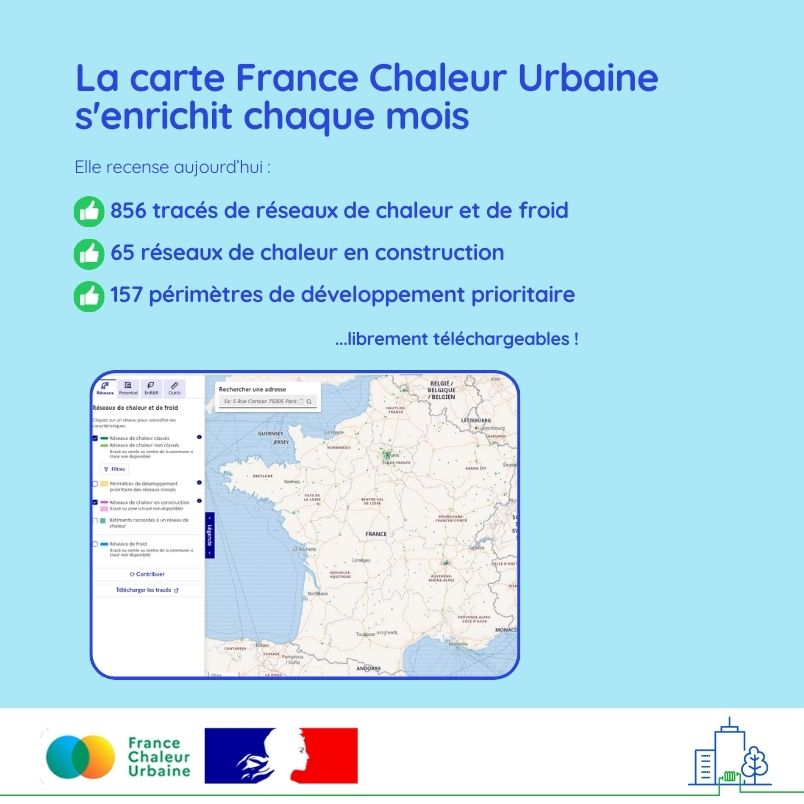

# La carte France Chaleur Urbaine s'enrichit !

🗺 Chaque mois, la carte France Chaleur Urbaine s'enrichit !\
\
👉 Ce mois-ci c’est notamment au tour des réseaux de [ForestEner](https://forestener.fr/), [CRAM](https://cram.fr/), du [SIEL Territoire d'énergie Loire](https://www.te42.fr/) et de la [Communauté d'agglomération Arlysère](https://www.arlysere.fr/) de voir leurs tracés compléter la carte. Des réseaux en cours de création ont aussi été ajoutés, notamment à Saint-Junien, Saverne, Doullens, Pont-Audemer, Châtenay-Malabry...\
\
La carte France Chaleur Urbaine, consultée par 10 000 visiteurs par mois en moyenne, compte désormais :\
✔ 821 tracés de réseaux de chaleur et 35 réseaux de froid en service,\
✔ 65 réseaux de chaleur en construction,\
✔ 157 périmètres de développement prioritaire.\
\
🙏 Merci à tous nos contributeurs : collectivités, acteurs locaux, opérateurs des réseaux, ADEME...\
\
Vous souhaitez ajouter un tracé ou un périmètre de développement prioritaire sur la carte, ou encore télécharger l'ensemble des tracés et données ? N'hésitez pas à [contribuer](https://france-chaleur-urbaine.beta.gouv.fr/contribution) !

<figure><figcaption></figcaption></figure>
