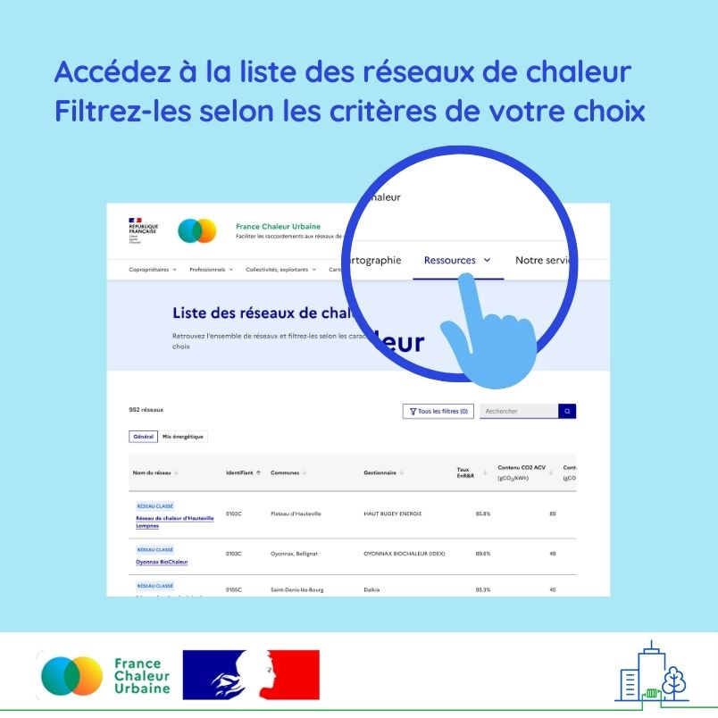
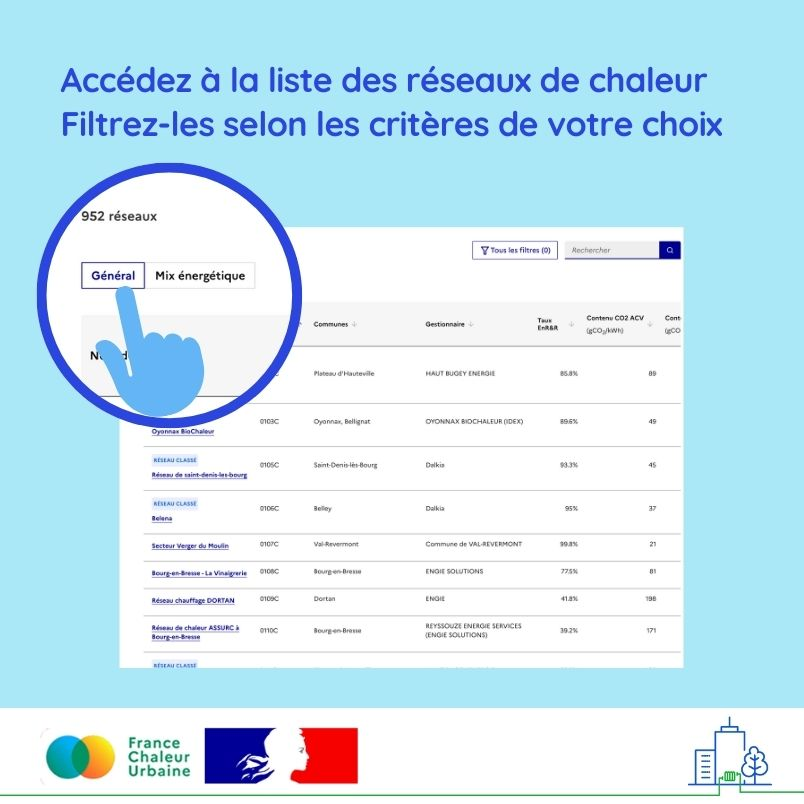
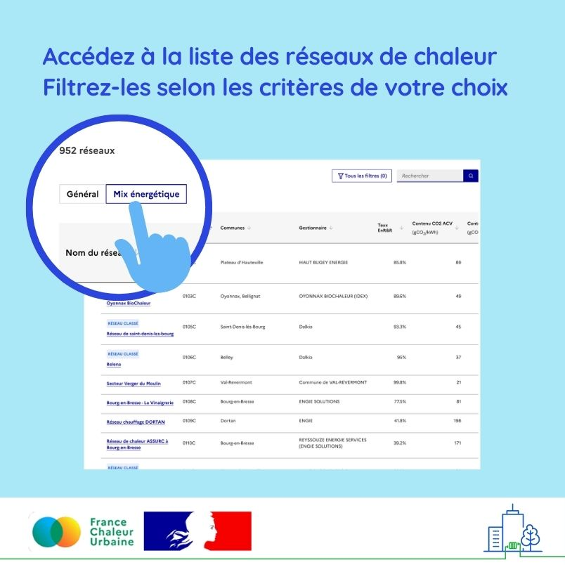

# La liste des réseaux de chaleur

📢 Encore du nouveau sur France Chaleur Urbaine ! Vous pouvez désormais accéder en un clic à la liste des réseaux de chaleur et les filtrer en fonction de différents critères : région, taux d’énergies renouvelables et de récupération, contenu en CO2, prix moyen de la chaleur, livraisons annuelles ou encore année de construction. Des filtres avancés vous permettent également de repérer des réseaux de chaleur avec un mix énergétique comparable.\
\
💡 Cette nouvelle fonctionnalité, exclusive à France Chaleur Urbaine, est notamment un atout de plus pour les collectivités souhaitant créer un réseau de chaleur. Elles pourront ainsi identifier des réseaux aux caractéristiques proches de celui qu'elles envisagent, et bénéficier de leur retour d’expérience pour affiner leur projet.

<figure><figcaption></figcaption></figure>

 

<figure><figcaption></figcaption></figure>

 

<figure><figcaption></figcaption></figure>

 

<figure><figcaption></figcaption></figure>

