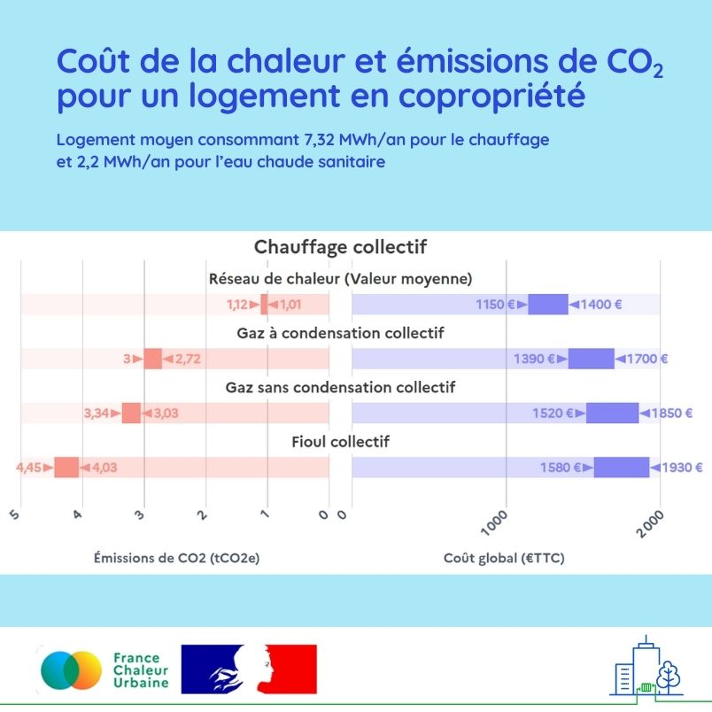

# Le chauffage urbain, une alternative écologique et compétitive aux chaudières fossiles

♨️ Pour remplacer une chaudière fossile en fin de vie, les réseaux de chaleur constituent une solution peu carbonée et compétitive !

La preuve en chiffres avec cette figure issue de notre nouveau comparateur des modes de chauffage et de refroidissement, comparant les émissions de CO2 et le coût global annuel du réseau de chaleur moyen français à ceux des chaudières collectives gaz et fioul, pour un logement moyen en copropriété.\
\
🔎 Pour réaliser une simulation adaptée à votre bâtiment, rendez-vous sur notre [comparateur](/comparateur-couts-performances), réalisé avec l'[Association AMORCE](https://amorce.asso.fr/) et le bureau d'études [Elcimaï](https://www.elcimai.com/) : un outil d'aide à la décision ergonomique, entièrement paramétrable.

Les dépenses énergétiques constituent une préoccupation majeure pour 85 % des Français et 75% d’entre eux continuent de restreindre leur chauffage pour limiter le montant de leurs factures. Le chauffage est aussi responsable de 15% des émissions de gaz à effet de serre du pays. Optimiser son choix est donc indispensable !

<figure><figcaption></figcaption></figure>
