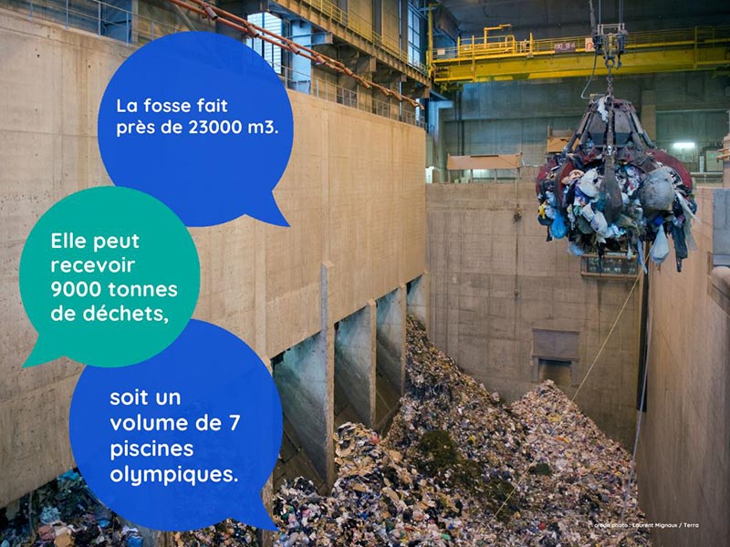

# Le classement des réseaux : quel bilan ?

Le classement automatique des réseaux de chaleur : sur le terrain, où en est-on ?\
\
✉ Pour le savoir, France Chaleur Urbaine a contacté les maîtres d'ouvrage de la quasi totalité des 598 réseaux concernés ! Des réponses ont d'ores et déjà été obtenues pour plus de 200 réseaux.\
\
**👉 Les premières conclusions ?**\
\
✔ 105 périmètres de développement prioritaire (PDP) ont été transmis à France Chaleur Urbaine pour intégration sur la carte. Vous souhaitez nous communiquer le PDP d'un réseau ? Vous pouvez le déposer directement sur notre site (lien en commentaire).\
\
❌ 91 réseaux ont été "déclassés" ou vont l'être : en majorité, il s'agit de petits réseaux en zone rurale, dimensionnés pour répondre aux seuls besoins des bâtiments déjà raccordés. D'autres raisons peuvent justifier un déclassement temporaire : approche de la fin de concession, schéma directeur ou travaux en cours de réalisation...\
\
🤔 un fort besoin d'information sur le sujet a été exprimé par un certain nombre de collectivités. Pour y répondre, France Chaleur Urbaine a organisé le 14 mars un webinaire dédié sur le sujet. Accéder au replay : [https://youtu.be/-tdP28Eq3G4](https://youtu.be/-tdP28Eq3G4)

<figure><figcaption></figcaption></figure>
