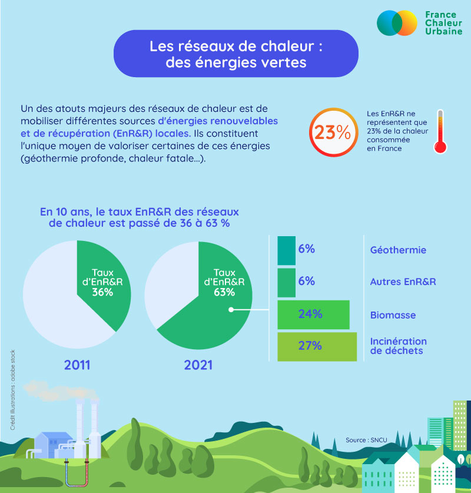

# Les réseaux de chaleur : des énergies verte

🌳 Les réseaux de chaleur sont-ils vraiment écologiques ? C'est une question que les usagers de France Chaleur Urbaine nous posent souvent. La réponse est oui ! Pourquoi ? Parce qu'ils exploitent des énergies renouvelables et de récupération locales faiblement carbonées :&#x20;

👉 la géothermie profonde, source d'énergie inépuisable que les réseaux de chaleur sont les seuls à exploiter&#x20;

👉 la chaleur issue de l'incinération des ordures ménagères, qui est de toute façon produite et que le chauffage urbain permet de récupérer et valoriser&#x20;

👉 la biomasse, issue de la gestion durable des forêts françaises et que les réseaux de chaleur permettent d'exploiter dans des systèmes performants préservant la qualité de l'air&#x20;

👉 mais aussi : le solaire thermique, encore peu utilisé en France, mais très développé chez certains de nos voisins européens (Suède, Danemark,...) / la chaleur récupérée des datacenters /...&#x20;

💚 Grâce au recours massif à ces énergies, la part de gaz et de fioul dans les réseaux de chaleur diminue d'année en année ! Quelques chiffres pour y voir plus clair ci-dessous :

