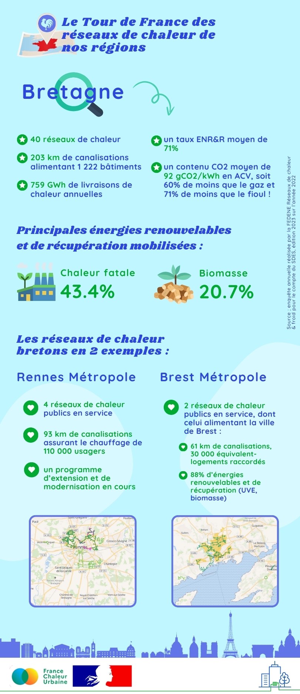

# Les réseaux de chaleur en région : focus sur la Bretagne

🚴‍♂️ Notre tour de France des réseaux de chaleur n'est pas fini ! Aujourd'hui, nous vous emmenons en [Région Bretagne](https://www.bretagne.bzh/).\
\
🔎 La région compte 40 réseaux de chaleur alimentés en moyenne à 71% par des érnergies renouvelables et de récupération, avec une part majoritaire de la chaleur fatale (UVE et industrielle). Plusieurs réseaux ont vu le jour ces dernières années, par exemple sur les territoires de [Lorient Agglomération](https://www.lorient-agglo.bzh/) ou [Lannion-Trégor Communauté](https://www.lannion-tregor.com/). Les réseaux de [Brest Métropole](https://brest.fr/) et [Rennes Ville et Métropole](https://metropole.rennes.fr/) poursuivent également leur développement, avec des travaux d'optimisation et extension conséquents.\
\
🤓 Pour en savoir plus en quelques chiffres-clés, c'est ici ! 👇

<figure><figcaption></figcaption></figure>
