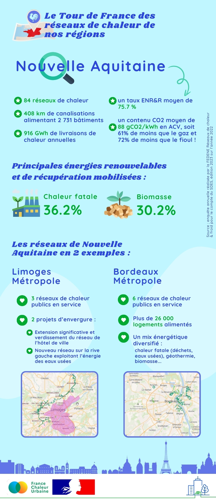

# Les réseaux de chaleur en région : focus sur la Nouvelle-Aquitaine

🚴‍♂️ Pour notre nouvelle étape du tour de France des réseaux de chaleur en région, direction la [Région Nouvelle-Aquitaine](https://www.nouvelle-aquitaine.fr/) !\
\
🔎 La région compte 84 réseaux recensés par l'enquête annuelle réalisée par la [FEDENE](https://fedene.fr/mission/reseaux-de-chaleur-et-de-froid/) pour le compte du Ministère de la transition écologique. Elle dispose de nombreuse sources d'énergies renouvelables et de récupération thermiques, et notamment d'un potentiel conséquent pour le développement de la géothermie profonde. Plusieurs réseaux de chaleur sont en cours de création, comme sur la Commune d'Oloron Sainte-Marie dans le [Département des Pyrenées-Atlantiques](https://www.le64.fr/), ou encore sur [Limoges Métropole](https://www.limoges-metropole.fr/), où deux projets vont permettre de doubler le linéaire des réseaux de la métropole.\
\
Les réseaux de chaleur de la Nouvelle Aquitaine en chiffres clés et exemples, c'est ci-dessous ! 👇

<figure><figcaption></figcaption></figure>

\
