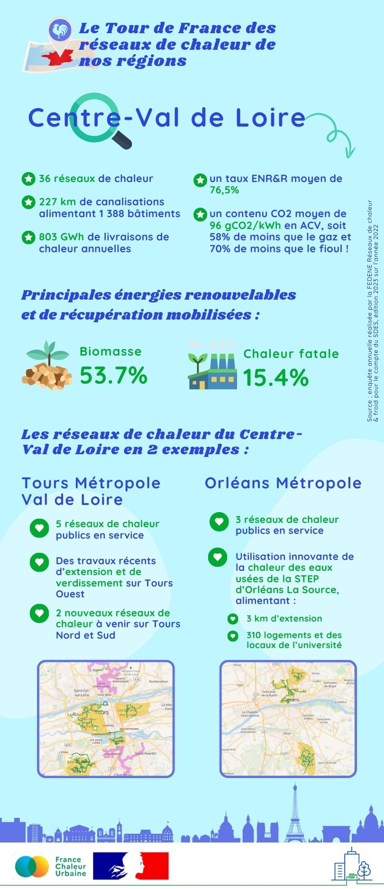

# Les réseaux de chaleur en région : focus sur le Centre-Val de Loire

🚴‍♂️ Pour notre tour de France des réseaux de chaleur en région, nous partons aujourd'hui pour la [Région Centre-Val de Loire](https://www.centre-valdeloire.fr/).\
\
🔎 L'enquête annuelle des réseaux de chaleur et de froid compte 36 réseaux de chaleur sur la région... D'après un recensement plus fin réalisé par l'ADEME en 2019, à cela s'ajoutent de nombreux petits réseaux, pour moitié alimentant uniquement leur maître d'ouvrage. En les incluant, le nombre de réseaux de chaleur en Centre Val de Loire grimpe à 220 !\
\
📈 Un nombre qui devrait continuer d'augmenter... Parmi les gros projets en cours, on peut par exemple citer deux nouveaux réseaux qui alimenteront dans les prochaines années Tours nord et le sud de Tours, venant s'ajouter aux 5 réseaux dont dispose déjà la métropole de Tours.\
\
🤓 Les réseaux de chaleur de Centre-Val de Loire en quelques chiffres clés et exemples, c'est ici ! 👇

<figure><figcaption></figcaption></figure>
