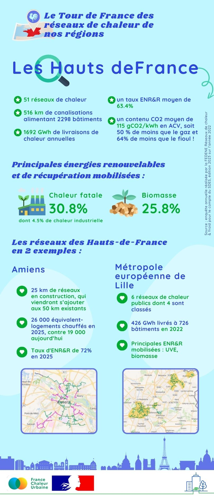

# Les réseaux de chaleur en région : focus sur les Hauts-de-France

🚲 Pour la deuxième étape de notre tour de France des réseaux de chaleur, direction les [Hauts-de-France](https://www.hautsdefrance.fr/) !\
\
🔎 Les Hauts-de-France, c'est 51 réseaux de chaleur alimentés à plus de 63% par des énergies renouvelables et de récupération, avec une part importante de chaleur fatale, et notamment industrielle. A titre d'exemple, le réseau de la [Communauté urbaine de Dunkerque](https://www.communaute-urbaine-dunkerque.fr/) récupère la chaleur des hauts fourneaux d'Arcelor Mittal la plus grande aciérie de France. Les projets de développement de réseaux ne manquent pas dans la région, comme à [Calais](https://www.calais.fr/fr/) ou [Amiens](https://www.amiens.fr/), avec plusieurs dizaines de kilomètres de nouveaux réseaux en construction !\
\
👇 On vous en dit plus en quelques chiffres clés dans l'infographie ci-dessous...

<figure><figcaption></figcaption></figure>
