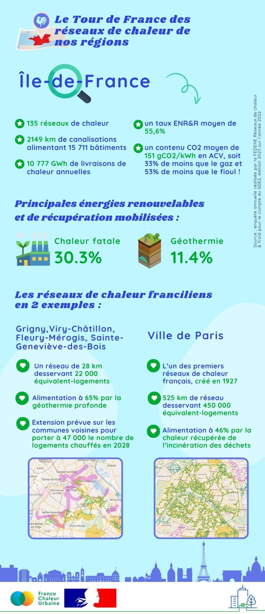

# Les réseaux de chaleur en région : focus sur l'Île-de-France

🚴‍♂️ Pour terminer notre tour de France des réseaux de chaleur, nous vous emmenons en [Région Île-de-France](https://www.iledefrance.fr/).

🏆 En matière de réseaux de chaleur, l'Ile-de-France est sur le podium dans plusieurs catégories ! Au niveau national, il s'agit de la première région en termes de livraisons de chaleur annuelles par les réseaux : plus de 40% de la chaleur livrée par les réseaux français l'est en Ile-de-France. A l'échelle européenne, l'Ile-de-France compte la plus grande densité d'installations de géothermie profonde alimentant des réseaux de chaleur, avec plus d'une cinquantaine d'installations en fonctionnement.\
\
🛠 Et les réseaux de chaleur continuent de se développer en Ile-de-France ! De nombreux nouveaux réseaux géothermiques sont notamment en cours de création, à Malakoff, Epinay-sur-Seine et Villetaneuse, Garges-lès-Gonesse, Pantin - Le Pré-Saint-Gervais - Les Lilas, Châtenay-Malabry...\
\
Les réseaux de chaleur franciliens en quelques chiffres clés et exemples, c'est ici ! 👇

<figure><figcaption></figcaption></figure>
