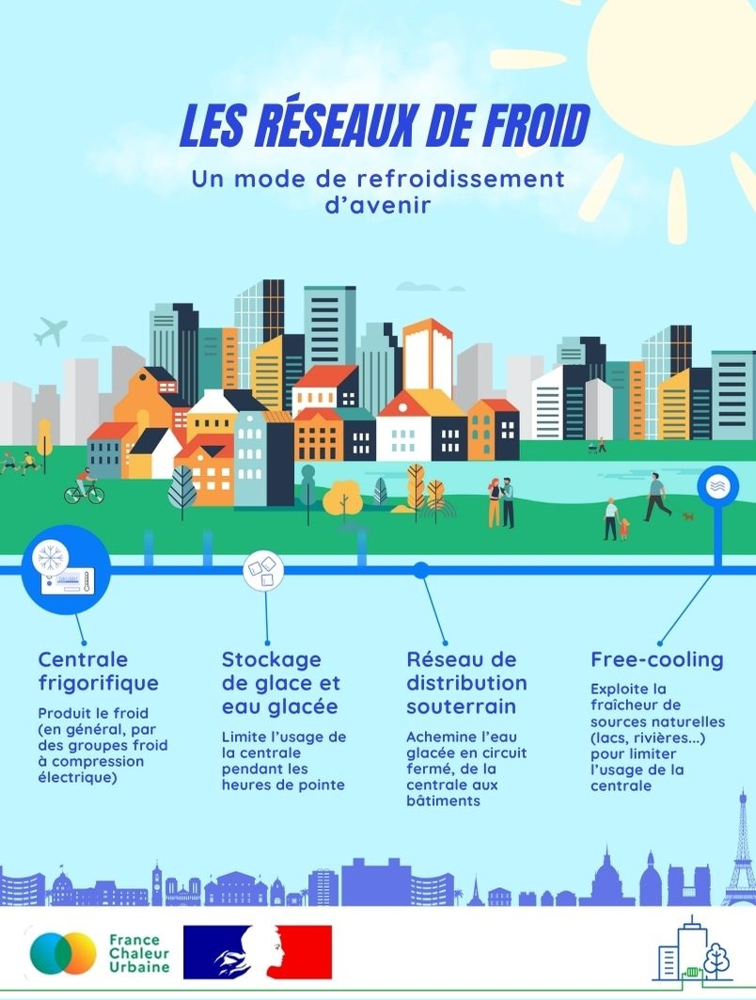

# Les réseaux de froid : comment ça marche ?

Comment fonctionne un réseau de froid ?

❄️ Le froid est produit au niveau d'une centrale frigorifique avec une efficacité énergétique supérieure à celle des systèmes de climatisation individuels, puis acheminé vers un ensemble de bâtiments via des canalisations souterraines. Pour limiter l'usage de la centrale et les consommations énergétiques associées, la fraîcheur de sources naturelles peut être exploitée en complément (rivière, lac, mer...).

💦 C'est par exemple le cas du réseau de froid de Paris, qui exploite la fraîcheur de la Seine, ou encore du réseau d'Annecy, qui utilise la fraîcheur du lac. A Marseille, c'est l'eau de la Méditerranée qui est exploitée !

Pour en savoir plus sur ces réseaux, rendez-vous dans nos prochaines actualités...

<figure><figcaption></figcaption></figure>
