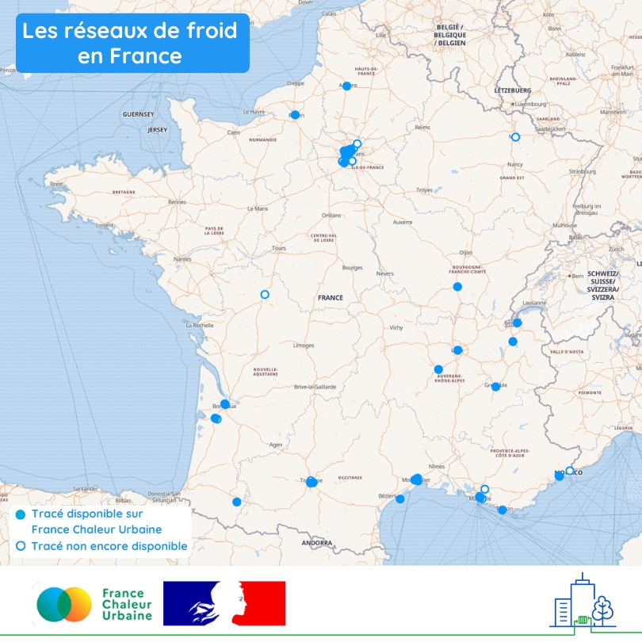

# Les réseaux de froid en France

🤓 Après vous avoir fait découvrir la répartition territoriale des réseaux de chaleur en France, focus aujourd'hui sur les réseaux de froid !\
\
❄️ Les réseaux de froid constituent un moyen efficace pour rafraîchir les bâtiments en ville, avec de hautes performances énergétiques et sans les nuisances souvent associées aux modes de refroidissement individuels (contribution aux îlots de chaleur urbains, nuisances sonores...).\
\
Ils sont aujourd'hui peu nombreux : leur développement constitue donc un enjeu majeur, dans un contexte de réchauffement climatique et de vieillissement de la population.\
\
54 repères sont présents sur la carte ci-dessous, qui correspondent chacun à un réseau de froid :\
🔵 les ronds représentent les 36 réseaux de froid dont le tracé est visible sur la carte en ligne de France Chaleur Urbaine (dont 7 ne sont pas recensés par l'enquête annuelle des réseaux de chaleur et de froid)\
⚪ les cercles matérialisent 18 réseaux recensés par l'enquête annuelle dont le tracé reste à récupérer par France Chaleur Urbaine. Ils ne représentent que 23% des livraisons annuelles de froid en France.\
\
👉 Pour en savoir plus sur chacun de ces réseaux, rendez-vous sur notre [carte en ligne](/carte) !

