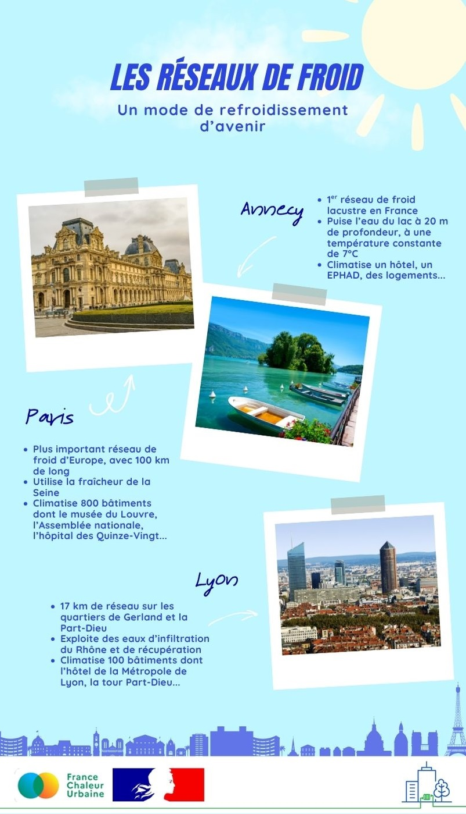

# Les réseaux de froid : quelques exemples

☀️ Alors qu'une canicule intense et précoce s'abat sur la France, et nous rappelle l'urgence de mettre en place des solutions efficaces d'adaptation au changement climatique, nous vous faisons découvrir aujourd'hui les réseaux de froid de Paris, Lyon, et Annecy.

❄️ Les réseaux de froid présentent de nombreux avantages par rapport aux climatiseurs individuels ou à l'échelle des bâtiments : ils offrent notamment de hauts rendements énergétiques et ne contribuent pas aux îlots de chaleur urbains. Ils permettent aussi d'exploiter des sources naturelles de fraîcheur : rivières, lacs, mer... Une quarantaine de collectivités en ont déjà équipé certains de leurs quartiers, à l'image des métropoles de Montpellier, Toulouse, Nice, Rouen, ou encore Saint-Etienne.

👉 Le développement des réseaux de froid constitue un enjeu majeur pour l'avenir !

<figure><figcaption></figcaption></figure>
