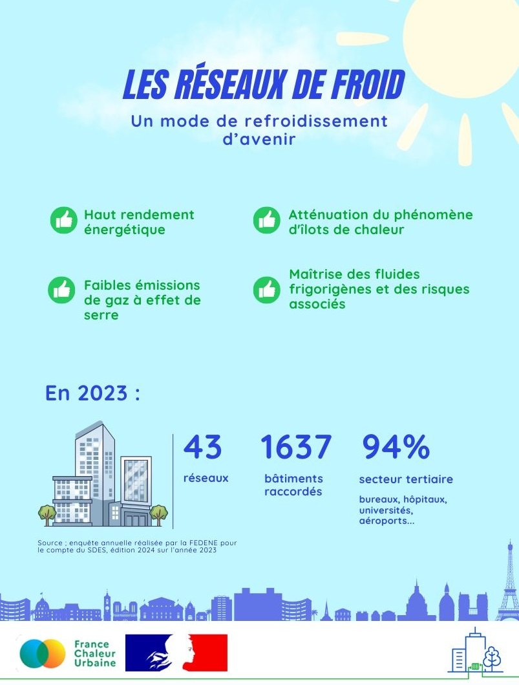

# Les réseaux de froid : quels atouts et où en est-on ?

☀️ De fortes chaleurs sont attendues pour la fin de semaine : c'est le moment de mettre à l'honneur les réseaux de froid, qui constituent un moyen efficace pour rafraîchir les bâtiments en ville.

❓Quels sont leurs atouts et où en est leur développement en France ? C'est ce que nous vous proposons de découvrir aujourd'hui !

Et pour savoir comment fonctionnent les réseaux de froid, suivez nos prochaines actualités !

<figure><figcaption></figcaption></figure>
