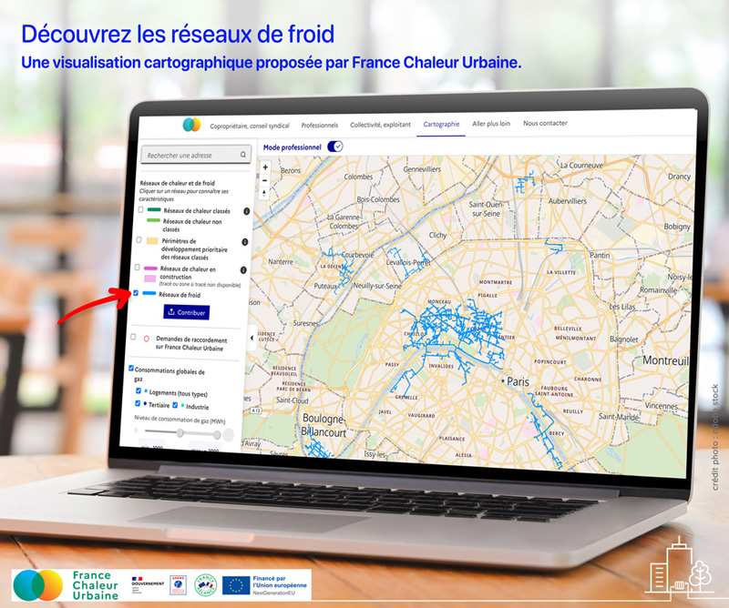

# Les réseaux de froid sur notre cartographie

En cette période de fortes chaleurs, découvrez la [cartographie des réseaux de froid](https://france-chaleur-urbaine.beta.gouv.fr/carte) France Chaleur Urbaine !

❄ Les réseaux de froid constituent une alternative écologique aux climatiseurs individuels : meilleure performance énergétique, faibles émissions de gaz à effet de serre, absence de contribution aux îlots de chaleur urbains...

🎯 Alors que les vagues de chaleur sont amenées à s'intensifier, les réseaux de froid devraient connaître une fort développement dans les années à venir. La programmation pluriannuelle de l’énergie (PPE) fixe un objectif de multiplication par 3 des livraisons de froid par ces réseaux en 2028, par rapport à 2016.

Pour en savoir plus, retrouvez également notre [infographie](https://france-chaleur-urbaine.beta.gouv.fr/img/FCU\_Infographie\_Froid.jpg) sur les réseaux de froid

