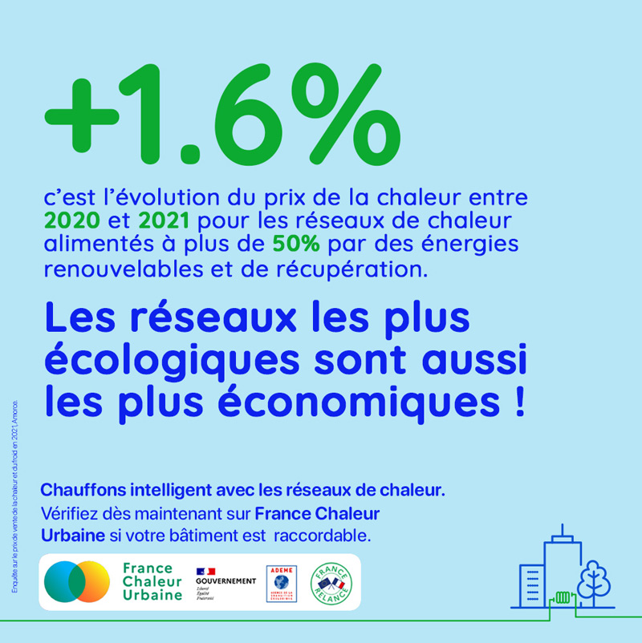

# Les réseaux les plus écologiques sont les plus économiques !

2022 a rappelé l'enjeu crucial que constitue la stabilité des tarifs de l'énergie. Le prix du gaz a augmenté de 103 % en un an (22% pour les ménages, grâce au bouclier tarifaire. Source : SDES). Or le prix des énergies renouvelables et de récupération locales est plus stable que celui des énergies fossiles : les réseaux de chaleur vertueux montrent ainsi encore une fois leur intérêt évident !

