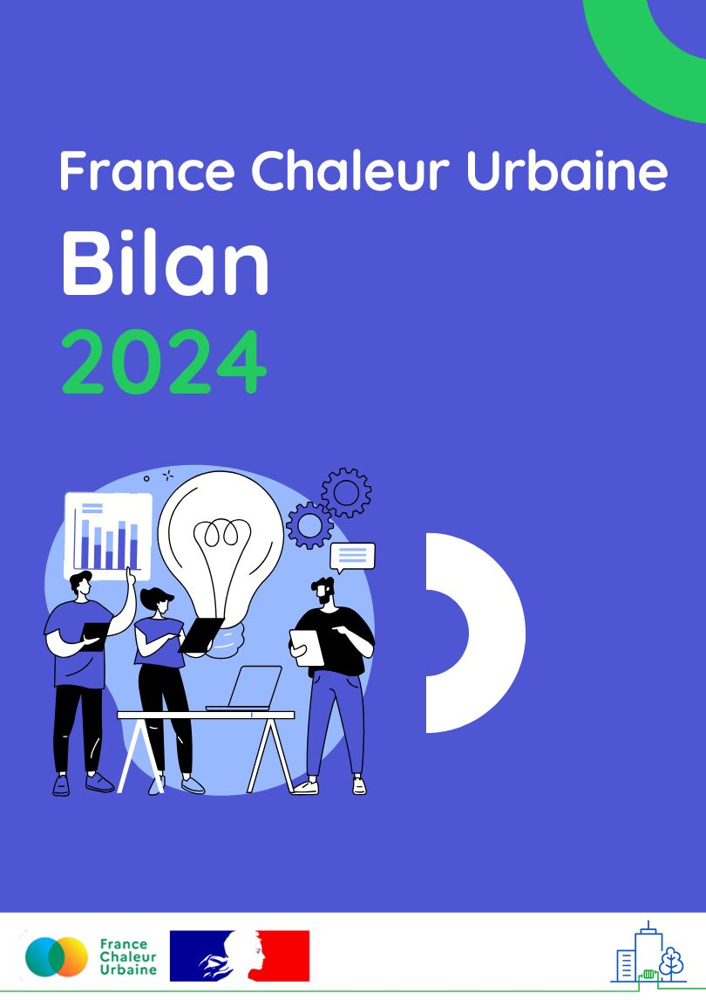

# Notre bilan 2024

Quel bilan pour France Chaleur Urbaine en 2024 ?

✔️ Des indicateurs de fréquentation et d'impact en forte augmentation&#x20;

✔️ De nouveaux outils pour répondre aux besoins exprimés par nos usagers&#x20;

✔️ Une communication active pour continuer à améliorer la connaissance des réseaux par le grand public&#x20;

✔️ Et une valeur ajoutée du service désormais largement reconnue !

🙏 Merci à tous nos usagers et partenaires pour cette année riche en interactions !

Pour en savoir plus, c'est ici  :

[https://france-chaleur-urbaine.beta.gouv.fr/documentation/FCU\_Bilan\_2024.pdf](https://france-chaleur-urbaine.beta.gouv.fr/documentation/FCU_Bilan_2024.pdf)

📈 Et pour suivre l'évolution de nos indicateurs mois par mois, rendez-vous sur notre [page statistiques](https://france-chaleur-urbaine.beta.gouv.fr/stats)

<figure><figcaption></figcaption></figure>

