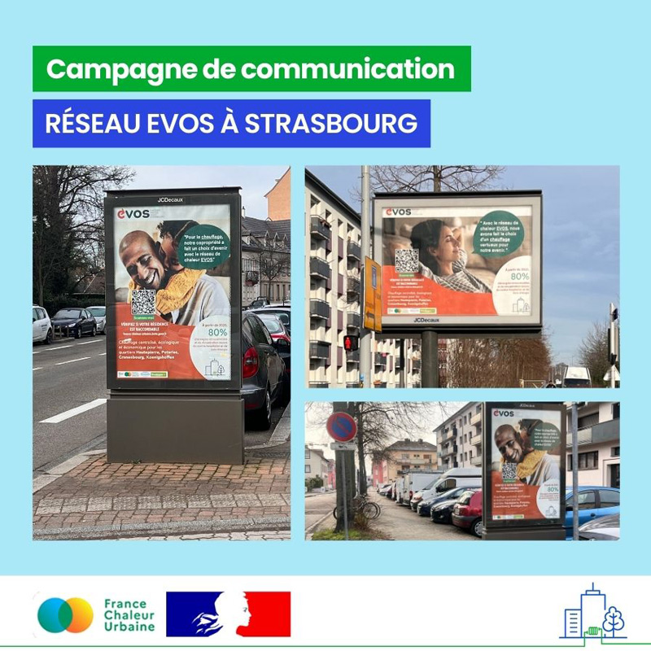
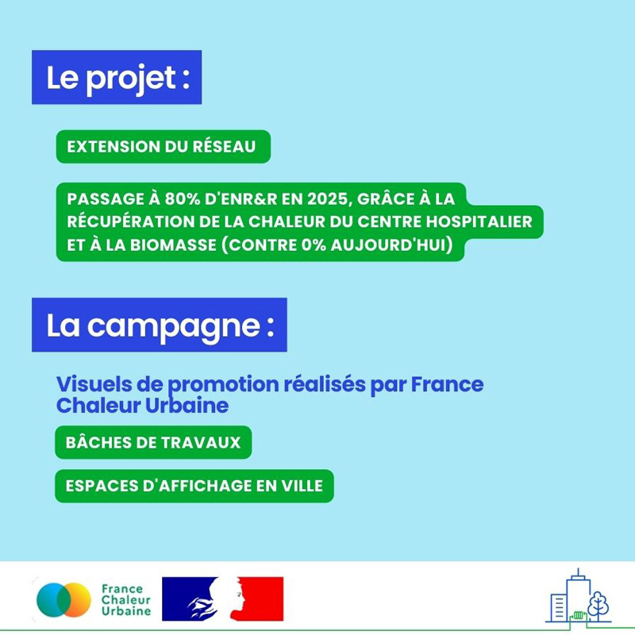

# Notre campagne sur Strasbourg

🍃 Pour décarboner les réseaux de chaleur, les solutions ne manquent pas ! A Strasbourg, c'est la récupération de la chaleur issue des équipements de production de froid du Centre hospitalier de Hautepierre qui a été choisie pour verdir le réseau [EVOS](<README (1).md>). Le premier client du réseau deviendra ainsi également son principal producteur d'énergie, permettant d'assurer 40% des besoins en chaleur du réseau. En complément, deux chaudières biomasse seront mises en place, pour atteindre dès 2025 un taux d'énergies renouvelables et de récupération de plus de 80%.\
\
🔨 Et ce n'est pas tout ! 30 kilomètres de réseau supplémentaires vont être créés, permettant de desservir à terme plus de 25000 équivalent-logements.\
\
Nous sommes heureux d'accompagner l'[Eurométropole de Strasbourg](des-reseaux-vertueux.md) et son délégataire ENGIE Solutions dans la communication autour de ce projet d'envergure, qui offrira aux habitants de l'ouest strasbourgeois une chaleur décarbonée à prix compétitif.\
\
👇 Découvrez ci-dessous notre campagne d'affichage en ville.

