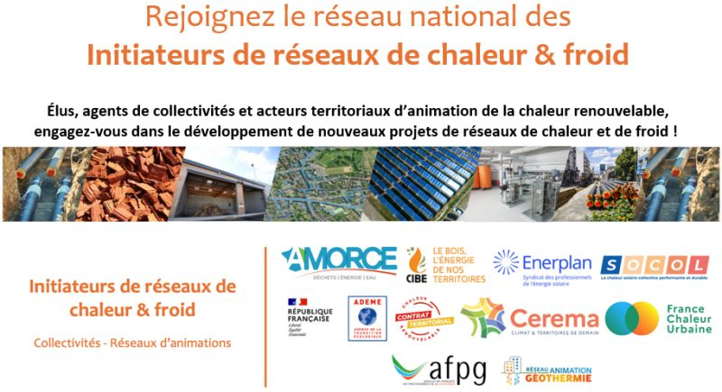

# Nouveau réseau national des "Initiateurs de réseaux de chaleur et de froid"

Vous êtes agent ou élu d'une collectivité territoriale, ou animateur territorial du Fonds Chaleur ADEME ?\
\
🙌 Rejoignez le nouveau réseau national des "Initiateurs de réseaux de chaleur et de froid", lancé par un collectif de partenaires dont nous avons le plaisir de faire partie !\
\
🎯 L'objectif de ce réseau ? Sensibiliser les collectivités au potentiel de création de réseaux de chaleur et de froid sur leur territoire, et leur donner toutes les clés pour lancer un projet. En effet, un fort potentiel existe sur plusieurs milliers de communes, encore inexploité.\
\
ℹ Concrètement, comment rejoindre le réseau ? Inscrivez-vous sans attendre sur la plateforme collaborative [Expertises territoires](https://www.expertises-territoires.fr/jcms/pl1\_404138/fr/initiateurs-de-reseaux-de-chaleur-froid). Vous aurez ainsi accès à un ensemble de ressources : outils cartographiques, conseils techniques et juridiques, retours d'expérience, actualités et événements... Vous pourrez également partager votre propre expérience et interrogations aux membres du réseau sur cette plateforme.\
\
Un réseau créé en partenariat avec l'[Association Amorce](https://amorce.asso.fr/), l'[Ademe](https://www.ademe.fr/), l'[AFPG](https://www.afpg.asso.fr/), le [Cerema](https://www.cerema.fr/fr), le [CIBE](https://cibe.fr/) et [ENERPLAN](https://www.enerplan.asso.fr/).

<figure><figcaption></figcaption></figure>

