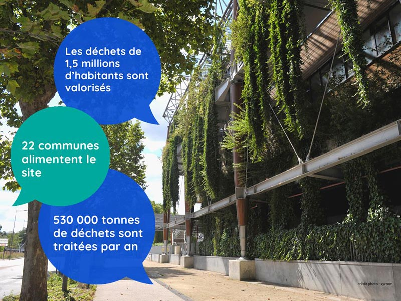

# Part des ENR\&R dans nos consommations de chaleur

❓ Quelle part représentent les énergies renouvelables et de récupération dont notre consommation de chaleur ?\
\
📈 La dernière édition du Panorama de la chaleur renouvelable et de récupération nous apprend qu'elle s'élevait à 27.2% en 2022, contre 22.3% en 2021. Une tendance à la hausse qui va devoir s'accentuer pour atteindre l'objectif fixé par le projet de Stratégie française pour l'énergie et le climat : 55% en 2030.\
\
♨ Les solutions ne manquent pas : la combustion de la biomasse, les pompes à chaleur, la géothermie de surface et profonde, la récupération de chaleur fatale, le solaire thermique... Les réseaux de chaleur sont le seul moyen de mobiliser massivement certaines d'entre elles (géothermie profonde, chaleur fatale...) : ils ont donc un rôle majeur à jouer !

<figure><figcaption></figcaption></figure>
