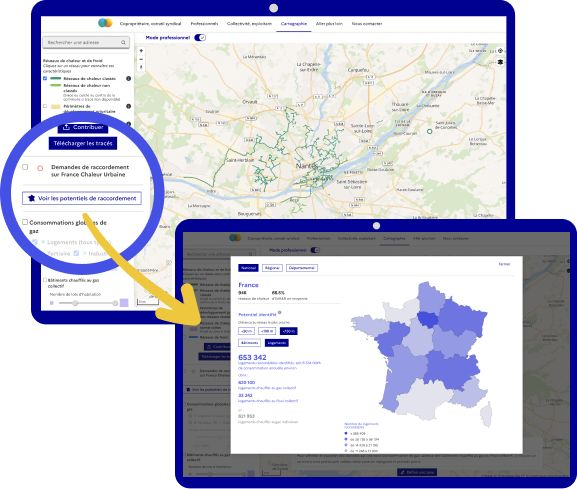

# Potentiels de raccordement par territoire

📢 Découvrez nos nouvelles données chiffrées sur les potentiels de raccordement dans votre territoire !\
\
🔎 Alors que les travaux de territorialisation de la planification écologique débutent, France Chaleur Urbaine vous permet de visualiser combien de logements ou bâtiments sont potentiellement raccordables aux réseaux de chaleur existants dans votre région ou département.\
\
Ces données sont issues d’un croisement entre les tracés des réseaux recensés par France Chaleur Urbaine et les données sur le mode de chauffage des bâtiments issues de la Base de données nationale des bâtiments du [CSTB](http://www.cstb.fr/fr/) et du Registre national d’immatriculation des copropriétés de l'[ANAH](https://www.anah.gouv.fr/).\
\
🏢 A l’échelle nationale, plus de 650 000 logements actuellement chauffés au gaz collectif ou fioul collectif sont identifiés à moins de 150 m d’un réseau !\
\
👉 Pour découvrir les chiffres : [https://france-chaleur-urbaine.beta.gouv.fr/carte?potentiels-de-raccordement](https://france-chaleur-urbaine.beta.gouv.fr/carte?potentiels-de-raccordement) ou cliquez sur le bouton "Voir les potentiel de raccordement" de notre cartographie.

\
