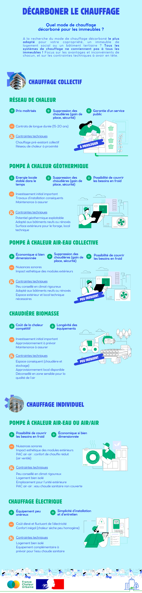

# Quel mode de chauffage décarboné pour mon immeuble ?

🌿 Quel est le mode de chauffage décarboné le plus adapté à mon immeuble ? Les solutions sont nombreuses et il peut être difficile de s'y retrouver... ce qui n'encourage pas le passage à l'action !

🏙️ Pourtant accélérer la décarbonation des bâtiments constitue l'un des enjeux majeurs pour atteindre la neutralité carbone en 2050. Aujourd'hui, les bâtiments sont responsables de 16% des émissions de gaz à effet de serre nationales, principalement du fait de l'usage de chauffages au gaz et fioul.

🔎 Pour y voir plus clair, nous vous proposons aujourd'hui une infographie récapitulant les principaux avantages et inconvénients des différents modes de chauffage décarbonés adaptés aux immeubles, ainsi que les contraintes techniques à avoir en tête.

👉 A diffuser largement !

<figure><figcaption></figcaption></figure>
