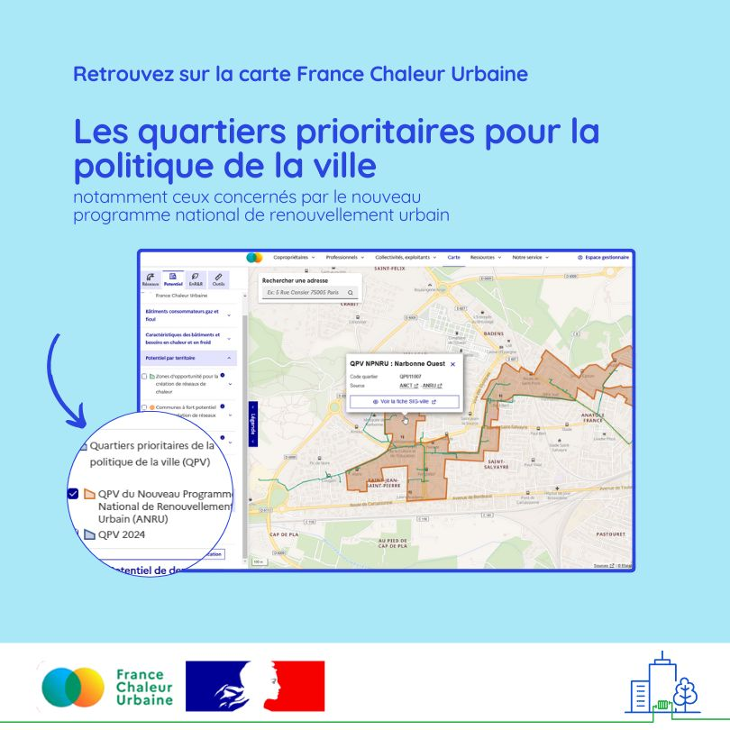

# Retrouvez les quartiers prioritaires pour la politique de la ville (QPV) sur notre carte

Encore une nouveauté sur la carte France Chaleur Urbaine !\
\
🏙️ Les quartiers prioritaires politique de la ville (QPV) y sont désormais affichés, et notamment les 422 quartiers métropolitains concernés par le nouveau programme national de renouvellement urbain (NPNRU) porté par l'[Agence Nationale pour la Rénovation Urbaine](https://www.anru.fr/) (ANRU). Un programme qui vise à transformer en profondeur ces quartiers, par le soutien aux actions conduites par les collectivités territoriales et les bailleurs sociaux sur le patrimoine bâti et les espaces extérieurs, dans une perspective notamment de transition écologique et de réduction de la précarité énergétique.\
\
♨️ Dans ces quartiers en renouvellement urbain, le potentiel de raccordement aux réseaux de chaleur, qui sont un outil puissant pour la transition énergétique, s’avère particulièrement important : 249 d’entre eux sont desservis par un ou plusieurs réseaux de chaleur en service, et 39 par des réseaux en construction (extension ou nouveau réseau). En outre, 143 des quartiers non desservis présentent un fort potentiel pour le développement d'un réseau !

Pour accéder directement aux QPV sur la carte, c'est [ici](https://france-chaleur-urbaine.beta.gouv.fr/carte?tabId=potentiel\&accordions=Potentiel+par+territoire\&additionalLayers=quartiersPrioritairesPolitiqueVille) !

<figure><figcaption></figcaption></figure>
