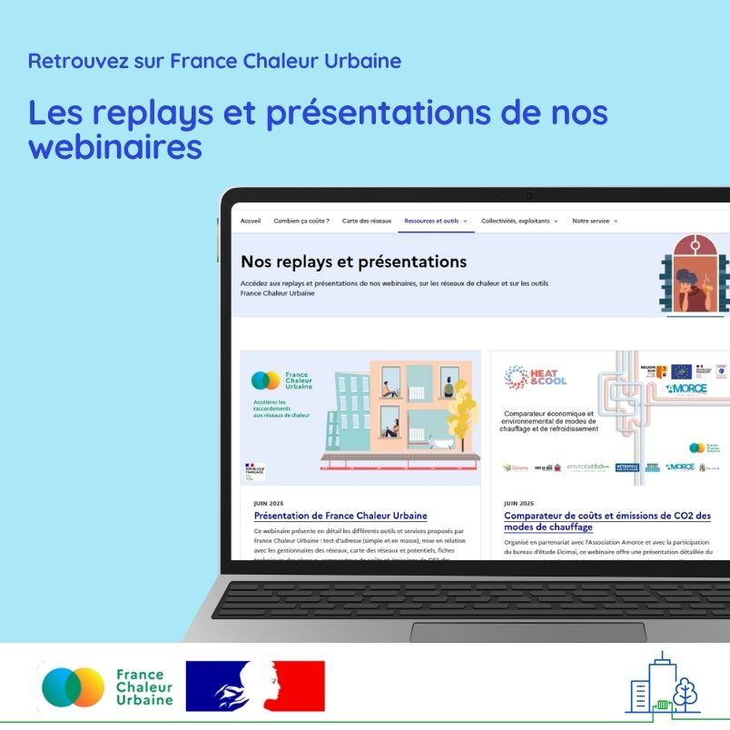

# Retrouvez les replays et présentations de nos webinaires

📹 Vous vous posez une question sur les réseaux de chaleur, ou sur les outils proposés par France Chaleur Urbaine ? Pour faciliter l'accès à l'information, les replays de nos webinaires sont désormais mis à disposition sur notre site, sur une [page dédiée](https://france-chaleur-urbaine.beta.gouv.fr/webinaires) !\
\
Dès à présent, vous y pourrez retrouver :\
✅ une présentation à jour de l'ensemble des outils et services proposés par France Chaleur Urbaine\
✅ un webinaire organisé en juin en partenariat avec l'Association Amorce et le bureau d'études Elcimaï, pour tout savoir sur notre comparateur de coûts et émissions de CO2 des modes de chauffage\
✅ notre webinaire annuel relatif au classement des réseaux de chaleur, avec des rappels réglementaires et retours d'expérience de collectivités\
✅ un webinaire organisé en janvier en partenariat avec le [Cerema](https://www.cerema.fr/fr) et l'[Association Amorce](https://amorce.asso.fr/), à destination des collectivités qui souhaitent initier un projet de réseau de chaleur sur leur territoire.

<figure><figcaption></figcaption></figure>
