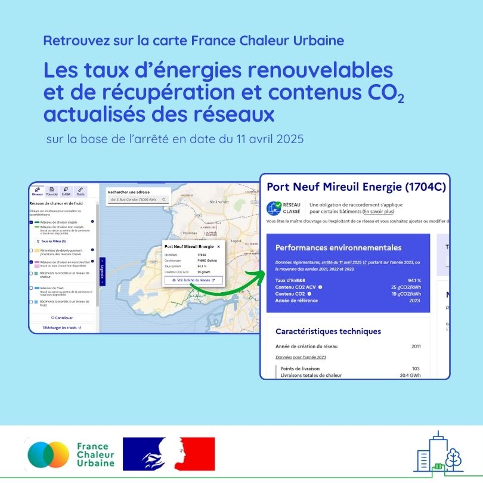

# Retrouvez les taux d'énergies renouvelables et contenus CO2 actualisés des réseaux

🏢 Pour la réalisation des diagnostics de performance énergétique (DPE) ou pour l'application de la réglementation environnementale des bâtiments neufs (RE2020), les caractéristiques des réseaux de chaleur et de froid à prendre en compte sont définies chaque année par un arrêté.\
\
🔎 Le [dernier arrêté, en date du 11 avril 2025](https://www.legifrance.gouv.fr/jorf/id/JORFTEXT000051520810), met à jour les taux d'énergies renouvelables et contenus CO2 des réseaux avec les données d'exploitation de l'année 2023 ou d'une moyenne sur les années 2021-2022-2023.\
\
💥 Les différents outils proposés par France Chaleur Urbaine ont été actualisés pour prendre en compte les nouvelles valeurs réglementaires. Vous pourrez les retrouver sur notre [carte](/carte), sur les fiches par réseau et sur la [liste des réseaux](/reseaux). Les simulations de notre [comparateur des coûts et émissions de CO2](/comparateur-couts-performances) des modes de chauffage se basent également sur ces nouvelles valeurs.

<figure><figcaption></figcaption></figure>
