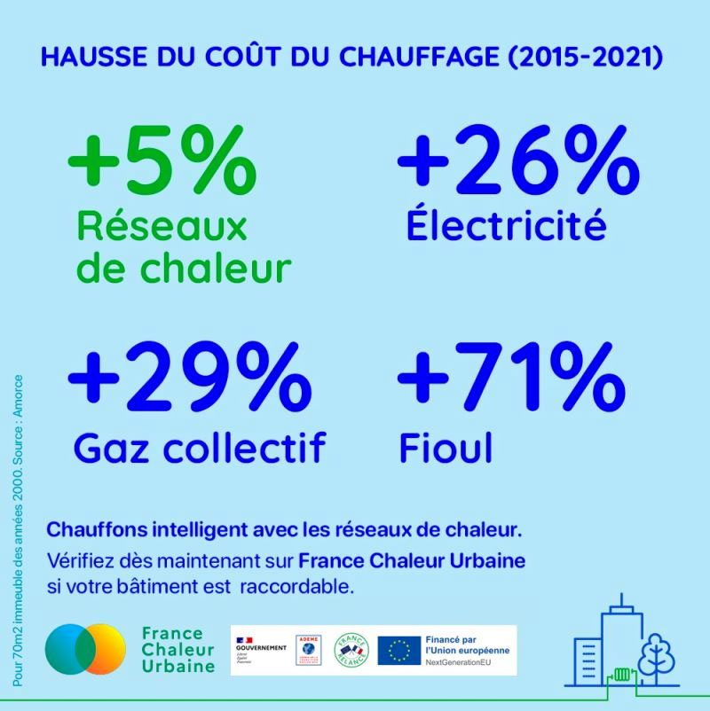

# Se chauffer à prix stables

💰 Un chauffage à prix stables ? C'est possible avec les réseaux de chaleur !

📈 La crise énergétique influence les prix du gaz, de l'électricité et du fioul, qui ne cessent d'augmenter.

✅ Les réseaux de chaleur disposent de tarifs compétitifs et moins fluctuants que les énergies purement fossiles. Entre 2015 et 2021, le prix de la chaleur fournie par les réseaux n'a augmenté que de +5%, 24% de moins que celui du gaz !

<figure><figcaption></figcaption></figure>

