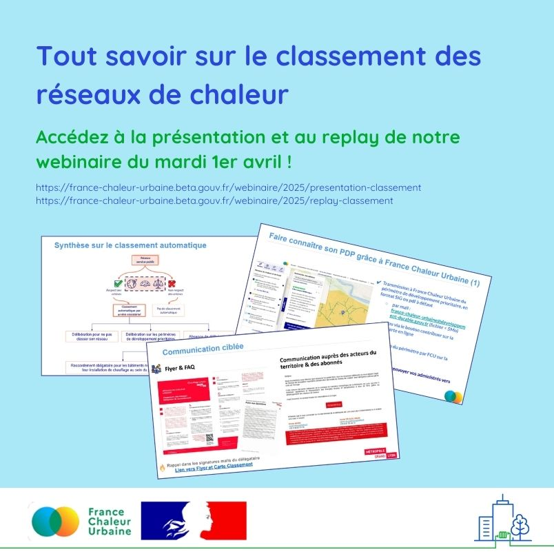

# Tout savoir sur le classement des réseaux de chaleur

Mardi dernier nous organisions notre webinaire annuel sur le classement des réseaux de chaleur. Merci aux 107 participants qui s'y sont connectés !\
\
🎥 Vous souhaitez accéder à la présentation et au replay ? C'est ici :&#x20;

[https://france-chaleur-urbaine.beta.gouv.fr/webinaire/2025/presentation-classement
\
https://france-chaleur-urbaine.beta.gouv.fr/webinaire/2025/replay-classement ](https://france-chaleur-urbaine.beta.gouv.fr/webinaire/2025/presentation-classementhttps://france-chaleur-urbaine.beta.gouv.fr/webinaire/2025/replay-classement)\
\
Au programme :\
✔️ Éléments de contexte : le classement automatique, quels objectifs ?\
✔️ Cadre réglementaire et mise en application, par Cindy Melfort du Cerema\
✔️ Utilisation de France Chaleur Urbaine pour faire connaître son réseau et les obligations de raccordement.\
\
Et des témoignages :\
✔️ Christine Rident (Rennes métropole) sur la réflexion autour de la procédure de classement.\
✔️ Sara Malleval et Didier Fangeat (Métropole de Lyon) et Elodie Bihen (Dalkia Lyon) sur la mise en place opérationnelle.\
✔️ Rémi Beaulieu (association Amorce) sur le classement pour les petits réseaux de chaleur.\
\
🗺️ Rendez-vous également sur notre [cartographie](https://france-chaleur-urbaine.beta.gouv.fr/carte) pour visualiser les réseaux classés et leur périmètre de développement prioritaire. Vous souhaitez ajouter des éléments sur la carte ? Vous pouvez passer par notre [formulaire de contribution](https://france-chaleur-urbaine.beta.gouv.fr/contribution).

<figure><figcaption></figcaption></figure>
