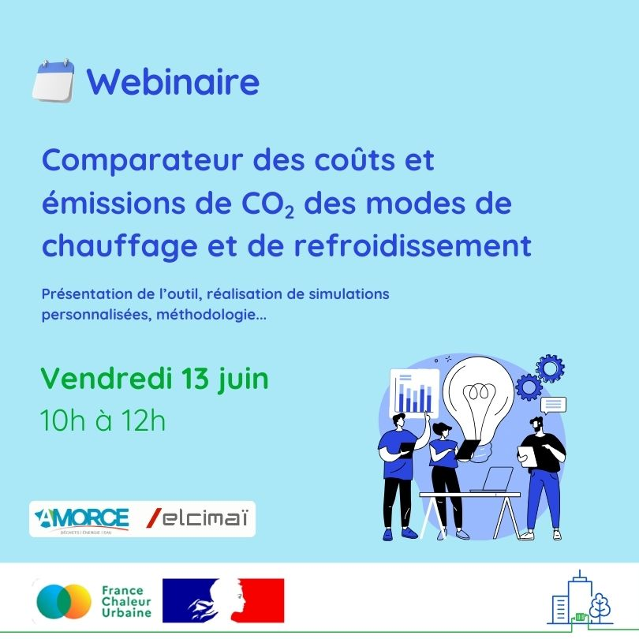

# Tout savoir sur notre comparateur des coûts et émissions de CO2 des modes de chauffage

📢 Suite à la mise en ligne de notre [comparateur de coûts et émissions de CO2](https://france-chaleur-urbaine.beta.gouv.fr/comparateur-couts-performances) des modes de chauffage, nous avons le plaisir de vous convier à un webinaire de présentation de l'outil, le 13 juin à 10h, co-organisé avec l'[Association Amorce](https://amorce.asso.fr/) et le bureau d'études [Elcimaï](https://www.elcimai.com/).\
\
Ce comparateur unique en son genre permet d’évaluer les performances des équipements sur toute leur durée de vie, en intégrant l’ensemble des coûts (installation, exploitation et entretien). Il s’adresse aussi bien au grand public qu’aux professionnels (collectivités, bureaux d'études, gestionnaires de parcs de bâtiments...) et permet de comparer 16 modes de chauffage différents.\
\
🤓 Comment utiliser ce nouvel outil innovant et réaliser des simulations personnalisées ? Sur quelles données se base le comparateur ? Quelles sont les hypothèses de calcul ? Nous répondrons à toutes vos questions !\
\
Le webinaire sera également l'occasion de recueillir vos retours et suggestions, afin de faire évoluer l'outil pour répondre au mieux à vos besoins.\
\
👉 Lien d'inscription : [https://amorce.asso.fr/evenement/webinaire-presentation-du-nouveau-comparateur-de-modes-de-chauffage-et-refroidissement-juin25](https://amorce.asso.fr/evenement/webinaire-presentation-du-nouveau-comparateur-de-modes-de-chauffage-et-refroidissement-juin25)

<figure><figcaption></figcaption></figure>
