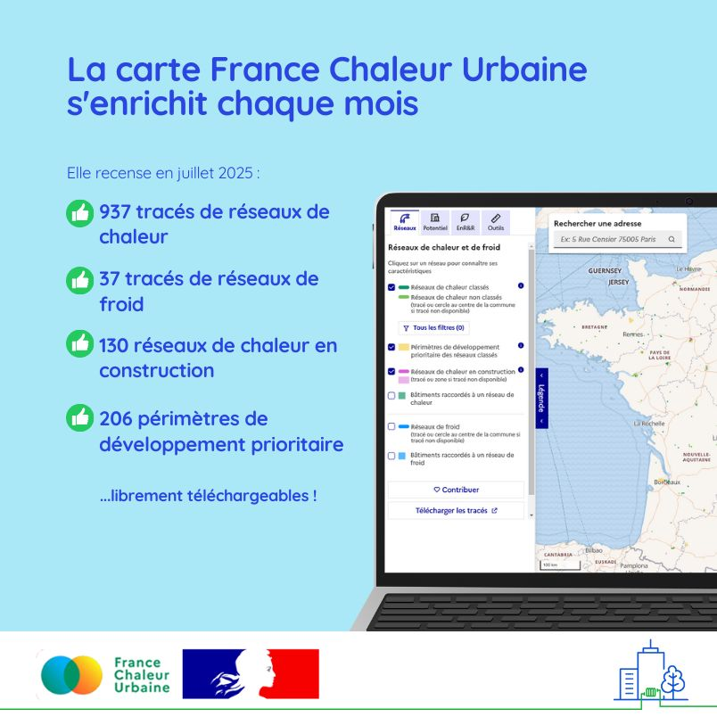

# Un enrichissement important de la carte ce mois-ci !

💥Pas moins de 37 tracés de réseaux de chaleur viennent d'être ajoutés sur la carte France Chaleur Urbaine ! Un grand merci à la [FEDENE](https://fedene.fr/) qui a permis cet enrichissement, en mobilisant ses contacts pour les réseaux répondant à l'enquête annuelle dont le tracé n'était pas encore recensé.

Aujourd'hui, la carte affiche ainsi les tracés de 937 réseaux de chaleur, représentant 97% des livraisons annuelles de chaleur en France.

🚀 Grâce aux contributions reçues dans le cadre des demandes de subvention au titre du [Fonds Chaleur](https://fondschaleur.ademe.fr/), la carte s'enrichit également de 13 réseaux en construction (nouveaux réseaux et extensions), notamment à Château-Chinon, Cannes (croisette), Aix-en-Provence, Clichy-sous-Bois et Livry-Garan, Mantes-la-Jolie, Châteaumeillant, La Teste-de-Buche ou encore Martigues.

Enfin, les périmètres de développement prioritaire de 5 réseaux classés ont été ajoutés à Saumur, Belfort, Notre-Dame-des-Millières, Mantes-la-Jolie, Strasbourg.

👉 Toutes les données sont visibles sur notre [carte](/carte) et téléchargeables sur [data.gouv.fr](https://www.data.gouv.fr/datasets/traces-des-reseaux-de-chaleur-et-de-froid/)

<figure><figcaption></figcaption></figure>
