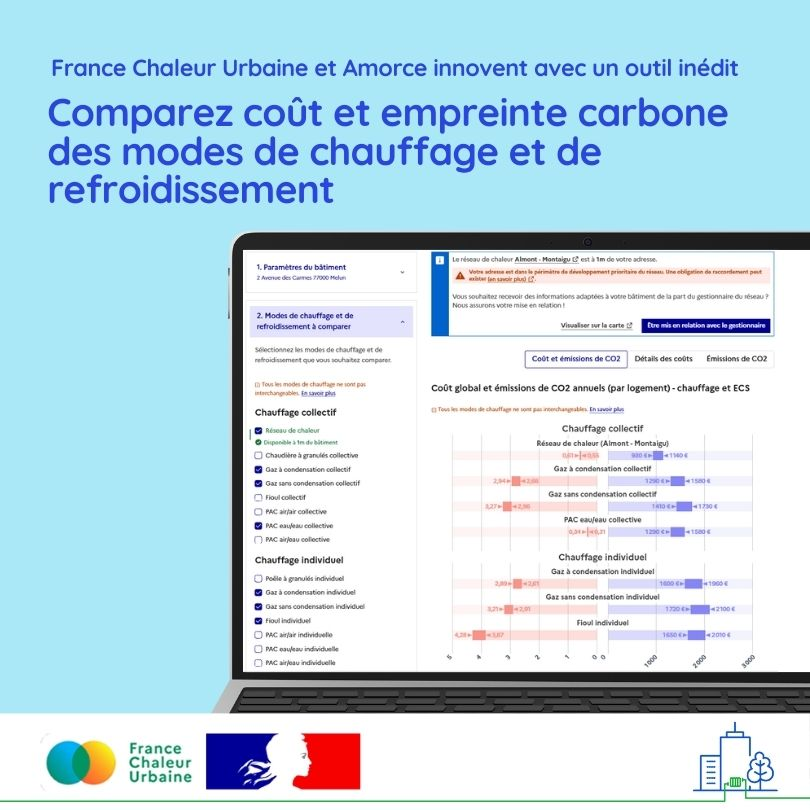

# Un outil innovant pour comparer coût et impact carbone des modes de chauffage et de refroidissement

**France Chaleur Urbaine et Amorce lancent un** [**comparateur**](/comparateur-couts-performances) **inédit qui permet d’obtenir instantanément les coûts et les émissions de CO2 des différents systèmes de chauffage et de refroidissement en fonction de l'adresse et des caractéristiques d'un bâtiment.**

Ce comparateur unique en son genre permet d’évaluer les performances des équipements sur toute leur durée de vie, en intégrant l’ensemble des coûts : installation, exploitation et entretien. Il s’adresse aussi bien au grand public qu’aux professionnels, collectivités et bureaux d’études.&#x20;

Deux niveaux d’utilisation sont proposés, avec :

• un **mode grand public**, conçu pour les utilisateurs non-experts. Il repose sur une interface intuitive avec des paramètres pré-renseignés, focalisée sur la comparaison entre les réseaux de chaleur et les modes fossiles ;

• un **mode avancé**, également ouvert à tous mais accessible sur création de compte. Destiné aux utilisateurs plus expérimentés, il permet de modifier un large éventail de variables. Il offre ainsi une analyse plus fine et personnalisée des systèmes en fonction des spécificités du projet. Le mode avancé comprend également des modes de chauffage non-fossiles (pompes à chaleur, radiateurs électriques, chaudières biomasse…), ainsi que différents modes de refroidissement.

L’outil repose sur un important travail technique, dont toutes les hypothèses et sources de données sont détaillées dans une note méthodologique.&#x20;

**Un enjeu économique et environnemental majeur**&#x20;

Les dépenses énergétiques constituent une préoccupation majeure pour 85 % des Français et 75% d’entre eux continuent de restreindre leur chauffage pour limiter le montant de leurs factures (1). Le chauffage est aussi responsable de 15% des émissions de gaz à effet de serre du pays (2). Optimiser son choix est donc indispensable !

_Le travail technique sur lequel repose le comparateur a été réalisé par le bureau d’études ELCIMAI sous le pilotage de l’Association Amorce, et sur financement par le programme européen Heat\&Cool LIFE. La plateforme web a été conçue et réalisée par France Chaleur Urbaine, un service numérique du ministère de la Transition Écologique, financé par l'ADEME, la Direction générale de l'énergie et du climat et la Direction interministérielle du numérique._

_(1) Baromètre énergie-info 2024, Médiateur de l’énergie. (2) Rapport Secten sur l’année 2023, Citepa._

[https://france-chaleur-urbaine.beta.gouv.fr/comparateur-couts-performances](https://france-chaleur-urbaine.beta.gouv.fr/comparateur-couts-performances)

