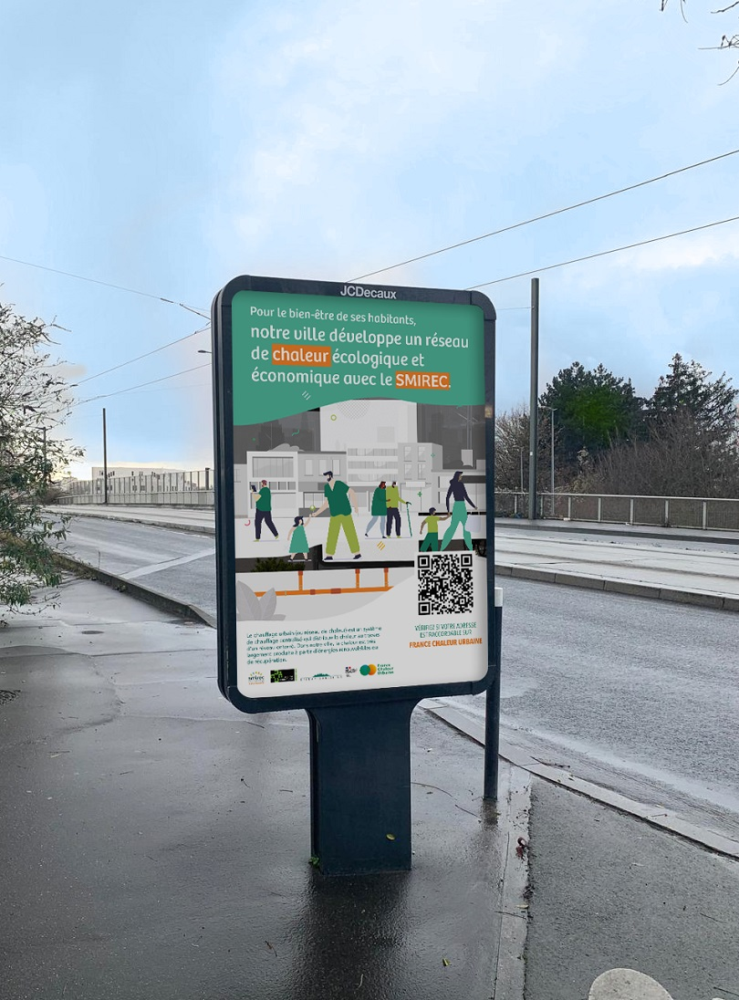

# Une campagne de communication en Seine-Saint-Denis

🤝 Depuis plusieurs années, France Chaleur Urbaine accompagne les collectivités et gestionnaires de réseaux de chaleur dans la promotion de leurs réseaux. Pour que le développement des réseaux de chaleur s'amplifie, il est en effet indispensable de les faire mieux connaître !

Cet hiver, nous sommes heureux d'avoir travaillé avec le [SMIREC](https://www.smirec.fr/) sur une campagne d'affichage en ville sur les communes de Saint-Denis, Pierrefitte-sur-Seine et Epinay-sur Seine en Seine-Saint-Denis. Les visuels de la campagne, produits par France Chaleur Urbaine, ont également été repris en quatrième de couverture du journal de Saint-Denis.

📢 Collectivités, vous souhaitez faire connaître votre réseau de chaleur et valoriser votre engagement pour la transition énergétique ? N'hésitez pas à [nous contacter](/contact) pour découvrir les services gratuits proposés par France Chaleur Urbaine !

Redécouvrez également toutes nos campagnes ici : [https://france-chaleur-urbaine.beta.gouv.fr/ressources/actions-de-communication](/ressources/actions-de-communication)

<figure><figcaption></figcaption></figure>
