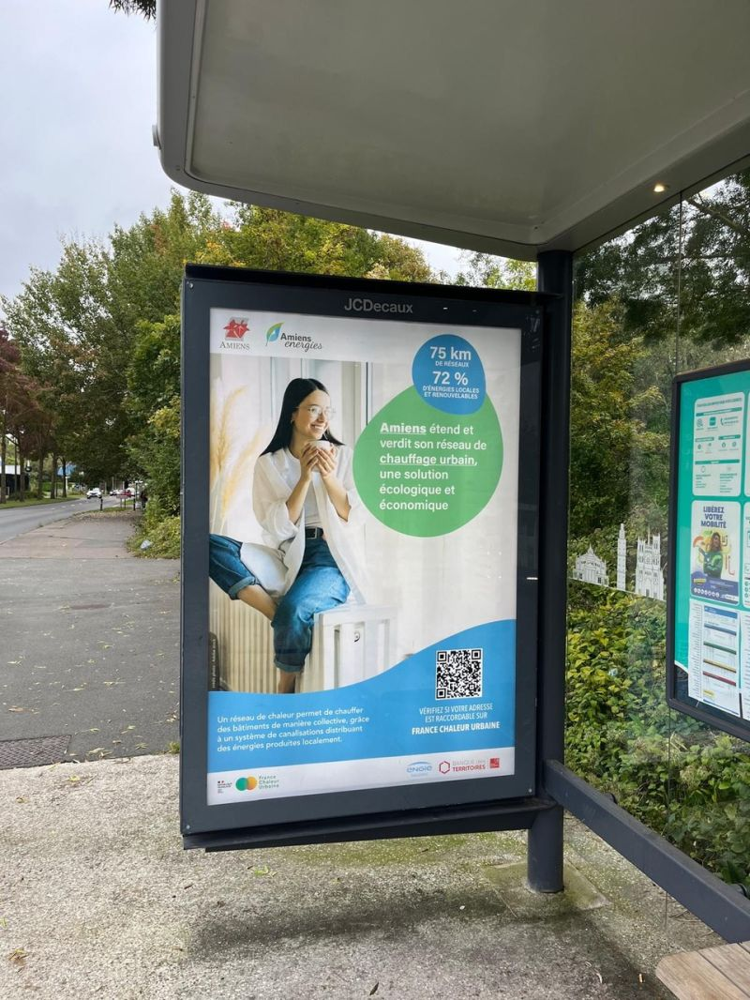

# Une campagne de communication sur la ville d'Amiens

💡 En ce début de saison de chauffe, c'est le moment idéal pour mettre en lumière les réseaux de chaleur ! Nous sommes ravis d'avoir eu l'opportunité d'accompagner la ville d'Amiens et son délégataire [Amiens Énergies](https://www.rezomee.fr/amiens-energies/) dans la mise en place d'une campagne de communication. Depuis quelques jours, les affiches ci-dessous sont visibles à travers toute la ville.\
\
🍃 Cette campagne vise à valoriser les efforts de la collectivité pour l'extension et le verdissement de son réseau de chaleur, mais aussi à sensibiliser et informer les Amiénois sur ce mode de chauffage.\
\
La communication sur les réseaux de chaleur par les collectivités est fondamentale ! Le réseau de chaleur étant une solution collective, sa réussite dépend en effet en partie de la connaissance et de l'adhésion des habitants. Cette communication permet aussi de montrer que les villes prennent activement part à la transition énergétique.\
\
👉 France Chaleur Urbaine encourage et accompagne toutes les initiatives de communication, n'hésitez pas [nous contacter](https://france-chaleur-urbaine.beta.gouv.fr/contact) !

<figure><figcaption></figcaption></figure>
