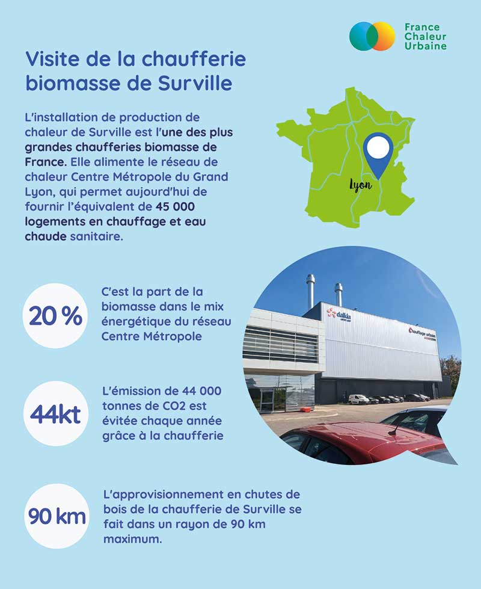
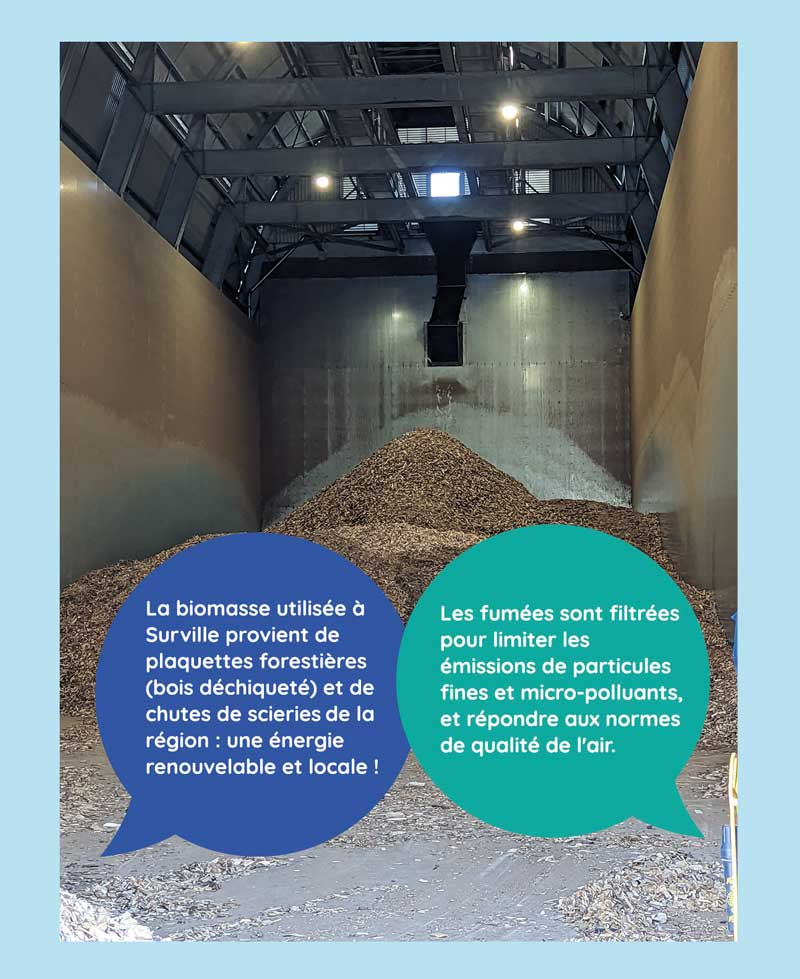
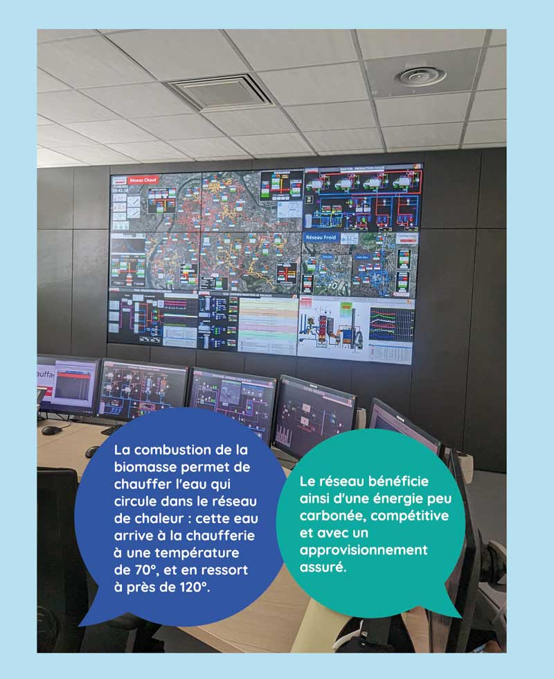

# Visite d'une chaufferie biomasse

Après notre infographie sur la biomasse, direction la Métropole de Lyon pour une illustration en images, avec la chaufferie de Surville. Mise en service en 2019, elle constitue une source d'énergie renouvelable et locale alimentant le réseau de chaleur Centre Métropole de Lyon.\
Merci à Dalkia pour l'organisation de cette visite !

<figure><figcaption></figcaption></figure>

 

<figure><figcaption></figcaption></figure>

 

<figure><figcaption></figcaption></figure>

