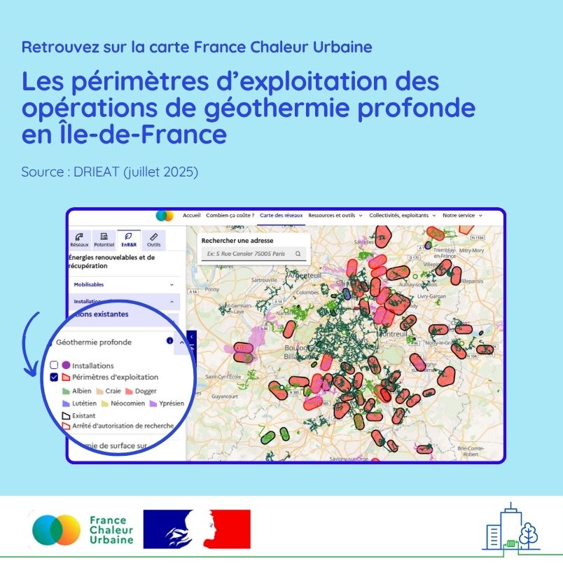

# Visualisez les périmètres d'exploitation des opérations de géothermie profonde

♨️ Vous vous intéressez à la géothermie en Île-de-France ?\
\
Bonne nouvelle : la carte France Chaleur Urbaine intègre désormais les périmètres d’exploitation des opérations de géothermie profonde ! Ces zones sont clés pour savoir si un projet est possible sur votre territoire, ou si un permis est déjà actif à proximité.\
\
Une donnée précieuse pour éviter les interférences entre projets et mieux planifier vos actions à l’échelle intercommunale (les périmètres dépassent souvent les limites des communes), fournie par la [DRIEAT (Direction régionale et interdépartementale Environnement-Aménagement-Transports)](https://www.drieat.ile-de-france.developpement-durable.gouv.fr/).\
\
👉 Pour accéder à cette nouvelle couche, c'est [ici](https://france-chaleur-urbaine.beta.gouv.fr/carte?additionalLayers=geothermieProfonde\&coord=2.4784755,48.7780440\&zoom=9.60\&tabId=enrr\&accordions=Installations+existantes) !\
\
A noter que d'autres données sur la géothermie sont également disponibles sur la carte, par exemple les installations de géothermie de surface issues du [BRGM](https://www.brgm.fr/fr).

<figure><figcaption></figcaption></figure>
